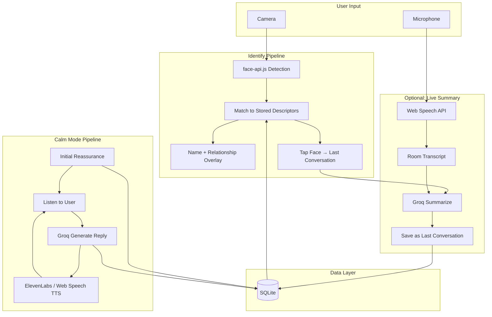
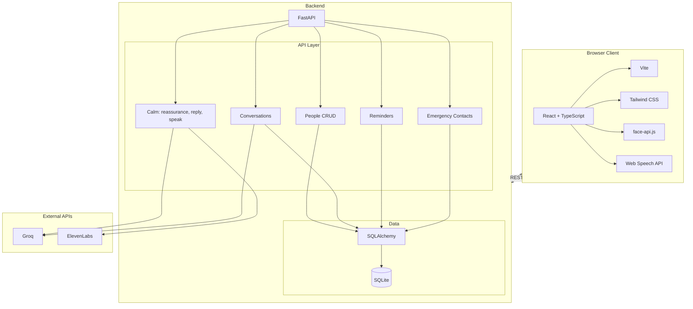

# Recall

<div style="margin: -10px 0;" align="center">
           <br />
  <p align="center">
    <a href="https://devpost.com/software/recall-y8i430">
      <strong>« HackHive DevPost »</strong>
               <br />
    </a>
  </p>
</div>
A gentle companion for people with Alzheimer's: see who's in front of you, recall your last conversation, and get calm reassurance with one tap.

Recall is a web application that helps people with Alzheimer's and other memory-related conditions—and their caregivers—stay oriented, connected, and safe. Real-time face recognition answers "Who is this?" at a glance. Per-person conversation memory answers "What did we talk about?" One-tap Calm Mode starts a real voice conversation that listens and reassures. Reminders and emergency (call + share location) support daily life and safety. All designed to be simple, private, and always on your side.

<div align="center">
  <a href="https://www.youtube.com/watch?v=RnzwBhRtdv8">
    
  </a>
</div>

---

## The Problem

People with Alzheimer's often **forget who someone is**—family, friends, caregivers—leading to embarrassment, anxiety, and withdrawal. They may **forget what was just discussed** with that person, making follow-up conversations difficult and repetitive. Caregivers re-explain relationships and recent topics over and over, which is emotionally draining. Many also feel **disoriented** (Where am I? What day is it?) and need calm reassurance. In a **crisis**—a fall, confusion, or wandering—they may be unable to call for help or share their location.

Existing solutions are fragmented: generic reminder apps don't answer "Who is this?"; video call apps don't surface last conversation; and one-way reassurance messages can't respond to what the person is actually feeling. Recall exists because **memory and orientation support should live in one place**, with one tap when they feel confused.

---

## How It Works

Recall combines a **live camera pipeline** (face recognition + optional conversation capture) with a **voice conversation pipeline** (Calm Mode) and **structured data** (people, conversations, reminders, emergency contacts). All core recognition runs in the browser; the backend provides persistence, AI summarization, and Calm Mode dialogue.

### High-Level Flow



### Identify Pipeline

The Identify screen runs a **live video feed** from the browser camera. face-api.js (tiny face detector + 68 landmark + recognition model) runs entirely in the browser: it detects faces, computes 128-dimensional descriptors, and matches them against descriptors stored when people were added. Only registered people are labeled; unknown faces are indicated. No video or face data is sent to the cloud for recognition—everything stays on-device. When the user **taps a recognized face**, the app shows that person's **last conversation** (date + summary) from the backend. Optionally, with the microphone enabled, the recent room transcript is sent to the backend; Groq summarizes it into 1–2 lines and the app saves it as that person's new last conversation.

### Calm Mode Pipeline

The **"I feel confused"** button in the nav is available on every page. When tapped, the app requests an **initial reassurance** from the backend (optionally with location and nearby person context); Groq generates a short message, and the app speaks it via ElevenLabs TTS or the browser's Web Speech API. Then the app **listens** (Web Speech API); the user's transcript is sent to `POST /api/calm/reply` with conversation history; Groq returns a calm, contextual reply; the app speaks it line-by-line. A **2.5 second delay** after speaking prevents the mic from picking up the app's own voice. Then the app listens again—creating a real back-and-forth, not a fixed script.

### People & Conversations

Caregivers or the user add **people** (name, relationship, one clear front-facing photo). The frontend computes a face descriptor from the photo and sends it with the person record to the backend; SQLite stores it. **Conversations** are stored per person: date + summary. They can be added or edited manually, or captured via the live-summary flow on Identify when Groq is configured.

### Reminders & Emergency

**Reminders** (label, time, repeat rule) are stored in SQLite and trigger in-app and browser notifications at the right time. **Emergency** stores a primary contact; the UI offers one-tap **Call** (tel: link) and **Share my location** (geo URL via SMS or mailto).

---

## System Architecture



### Frontend

- **React 18 + TypeScript + Vite** for the UI; **Tailwind CSS** for styling. Single-page app with React Router (Home, People, Identify, Conversations, Reminders, Emergency).
- **face-api.js** loads from jsDelivr (or local `public/models/`); runs detection and recognition on the camera stream and matches against descriptors from `GET /api/people/for-recognition`.
- **Web Speech API** for live transcription on Identify (optional) and for Calm Mode listening; fallback TTS when ElevenLabs is not configured.
- **CalmModeContext** manages the voice loop: reassurance → listen → reply (single-call guard) → speak → 2.5s delay → listen again.

### Backend

- **FastAPI** with Pydantic schemas; REST only (no WebSockets). Endpoints for people, conversations, reminders, emergency contacts, and Calm Mode (reassurance, reply, speak).
- **SQLAlchemy + SQLite** (single `remember_me.db`); foreign keys enabled via `PRAGMA foreign_keys=ON` on connect. Models: Person, Conversation, Reminder, EmergencyContact.
- **Groq** for (1) summarizing transcript → last conversation and (2) Calm Mode initial message and each reply. **ElevenLabs** for TTS in Calm Mode; 503 fallback to browser TTS.

### Data Layer

- **SQLite** holds all persistent data. Face descriptors and photo base64 are stored with Person; no external face DB. CORS is configured for the frontend origin; for production, run behind HTTPS.

---

## Technical Implementation

### Face Recognition (In-Browser)

Recognition runs entirely in the browser using [face-api.js](https://github.com/justadudewhohacks/face-api.js). Models (tiny face detector, 68 landmark, face recognition) are loaded from jsDelivr or from `frontend/public/models/` when the CDN is unavailable. On **People** add/edit, the frontend computes a descriptor from the photo and sends it with the person; the backend stores it. On **Identify**, the frontend fetches `GET /api/people/for-recognition` (id, name, relationship, face_descriptor), runs detection and recognition on each frame, and draws labels for matches above a similarity threshold. No video or descriptors are sent to the server for recognition—preserving privacy and enabling offline use for this flow.

### Calm Mode Voice Loop

To avoid the app "hearing itself," the mic is started only **after** a 2.5s delay following the last TTS playback. To avoid duplicate replies, the reply logic runs **outside** React state updaters with a `replyingRef` guard so only one `POST /api/calm/reply` runs per user message. Conversation history is passed so Groq can maintain context. The frontend shows a chat-style transcript (user + assistant) and supports stopping the conversation with one tap.

### Conversation Summarization

When the user taps a recognized face on Identify with the mic enabled, the frontend sends the **recent transcript** (Web Speech API interim/final results) to the backend. The backend calls Groq to produce a 1–2 sentence summary, then creates or updates a Conversation for that person with today's date and the summary. The UI then displays the updated last conversation.

### Optional: Local face-api Models

If the CDN is unavailable, download the [face-api.js weights](https://github.com/justadudewhohacks/face-api.js/tree/master/weights) into `frontend/public/models/` and set `MODEL_URL = "/models"` in `frontend/src/faceRecognition.ts`.

---

## Tech Stack

| Layer            | Technology                    | Purpose                                      |
| ---------------- | ----------------------------- | -------------------------------------------- |
| Frontend         | React 18, TypeScript, Vite    | Component-based UI with type safety          |
| Styling          | Tailwind CSS                  | Utility-first CSS, consistent design tokens   |
| Face recognition | face-api.js                   | In-browser detection and recognition         |
| Voice            | Web Speech API                | Live transcription, fallback TTS             |
| Voice (optional) | ElevenLabs API                | Natural TTS for Calm Mode                    |
| Backend          | FastAPI, Python 3              | REST API, OpenAPI docs                       |
| ORM              | SQLAlchemy                    | SQLite access                                |
| Validation       | Pydantic                      | Request/response schemas                     |
| Database         | SQLite                        | People, conversations, reminders, emergency |
| AI               | Groq                          | Summarization, Calm Mode dialogue             |
| Deploy           | Docker Compose                | Backend + frontend containers                |

---

## API Design

The backend exposes REST endpoints only. When the backend is running, full docs are at **http://localhost:8000/docs**.

### REST Endpoints

| Resource           | Methods / Endpoints | Description                                      |
| ------------------ | ------------------- | ------------------------------------------------ |
| People             | `GET/POST /api/people` | List, create                                     |
|                    | `GET/PATCH/DELETE /api/people/{id}` | Get, update, delete                          |
|                    | `GET /api/people/for-recognition`  | Minimal list for face recognition (id, name, relationship, descriptor) |
| Conversations      | `GET /api/people/{id}/conversations` | List conversations for a person              |
|                    | `GET /api/people/{id}/last-conversation` | Latest conversation                        |
|                    | `POST /api/conversations`           | Create (e.g. after summarization)           |
| Calm Mode          | `POST /api/calm/reassurance`        | Initial message (optional location, nearby person) |
|                    | `POST /api/calm/reply`              | Dialogue reply (user message + history)    |
|                    | `POST /api/calm/speak`              | TTS for text (or 503 → use Web Speech)      |
| Reminders          | `GET/POST/PATCH/DELETE /api/reminders` | CRUD reminders                            |
| Emergency contacts  | `GET/POST/PATCH/DELETE /api/emergency-contacts` | CRUD contacts                        |
| Health             | `GET /api/health`                   | Liveness check                              |

---

## Project Structure

```
P1/
├── frontend/                    # Vite + React application
│   ├── src/
│   │   ├── components/          # Layout, Navbar, Card, Button, Input, etc.
│   │   ├── context/             # CalmModeContext
│   │   ├── pages/               # Home, PeopleList, PersonForm, LiveView (Identify),
│   │   │                        # ConversationView, RemindersPage, EmergencyPage
│   │   ├── api.ts               # REST client (people, conversations, calm, reminders, emergency)
│   │   ├── faceRecognition.ts   # face-api.js load + detect + match
│   │   ├── App.tsx
│   │   └── main.tsx
│   ├── public/
│   └── package.json
│
├── backend/                     # FastAPI application
│   ├── main.py                  # Routes, Calm Mode + Groq + ElevenLabs integration
│   ├── database.py              # SQLite engine, session, init_db, PRAGMA foreign_keys
│   ├── models.py                # Person, Conversation, Reminder, EmergencyContact
│   ├── schemas.py               # Pydantic request/response models
│   ├── .env.example
│   └── requirements.txt
│
├── docs/                        # Documentation
│   ├── DEVPOST.md               # Devpost submission content
│   ├── DEMO-SPEECH.md           # 5-minute demo script
│   ├── PRD.md
│   └── FRD/                     # Feature requirement documents
│
├── docker-compose.yml            # Backend + frontend services
└── README.md
```

---

## Getting Started

### Prerequisites

- **Node.js 18+** and npm  
- **Python 3.10+**  
- **Optional:** [Docker](https://docs.docker.com/get-docker/) and [Docker Compose](https://docs.docker.com/compose/install/) for containerized run  
- **Optional:** [Groq](https://console.groq.com/) API key (conversation summarization + Calm Mode replies)  
- **Optional:** [ElevenLabs](https://elevenlabs.io/) API key (natural voice in Calm Mode)  

### Quick Start (local)

1. **Backend**
   ```bash
   cd backend
   python -m venv .venv
   .venv\Scripts\activate   # Windows
   # source .venv/bin/activate  # macOS/Linux
   pip install -r requirements.txt
   uvicorn main:app --reload --host 0.0.0.0 --port 8000
   ```

2. **Frontend**
   ```bash
   cd frontend
   npm install
   npm run dev
   ```

3. Open **http://localhost:5173**. Allow camera on **Identify**. Add a person under **People** (name, relationship, one clear photo), then try **Identify** and **I feel confused** (Calm Mode).

### Optional: API keys

- Copy `backend/.env.example` to `backend/.env`.
- Set `GROQ_API_KEY` for live conversation summarization (tap face on Identify) and Calm Mode dialogue.
- Set `ELEVENLABS_API_KEY` for natural TTS in Calm Mode (otherwise the browser's Web Speech TTS is used).

Without these keys, face recognition, people, reminders, and emergency still work; Calm Mode uses fallback messages and browser TTS.

### Docker

From the project root:

```bash
docker compose up --build
```

- **Backend:** http://localhost:8000  
- **Frontend:** http://localhost:5173  
- **API docs:** http://localhost:8000/docs  

Set `GROQ_API_KEY` and `ELEVENLABS_API_KEY` in the backend service environment for full AI and voice features.

| Command                    | Description              |
| -------------------------- | ------------------------ |
| `docker compose up -d`      | Run in background        |
| `docker compose down`       | Stop and remove          |
| `docker compose logs -f backend` | Stream backend logs |

---

## Documentation

- **Product & submission:** [docs/PRD.md](docs/PRD.md), [docs/DEVPOST.md](docs/DEVPOST.md)
- **API:** http://localhost:8000/docs when the backend is running

---

## Security & Privacy

- Camera and location are used only with explicit user permission.
- Face descriptors and photos are stored in the **local SQLite database**; they are not sent to any third party for recognition.
- For production, run behind HTTPS and configure CORS for your frontend origin.

---

## Engineering Practices

- **Separation of concerns:** Frontend handles capture and recognition; backend handles persistence and AI. Calm Mode keeps a single-call guard and delayed mic start to avoid feedback and duplicate replies.
- **Type safety:** TypeScript on the frontend; Pydantic on the backend for request/response validation.
- **Graceful degradation:** Missing Groq or ElevenLabs keys fall back to templates and browser TTS; people and Identify work without the backend for recognition (last conversation and summarization require the API).

---

## License

MIT License - see [LICENSE](LICENSE) for details.
