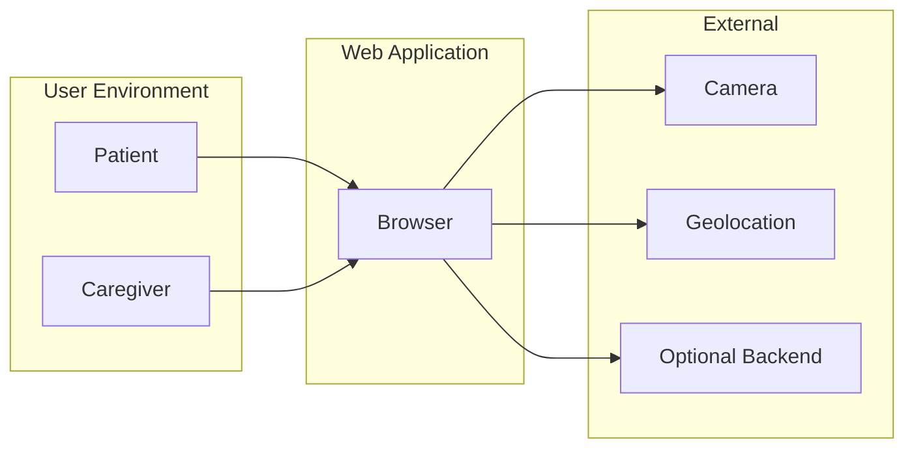
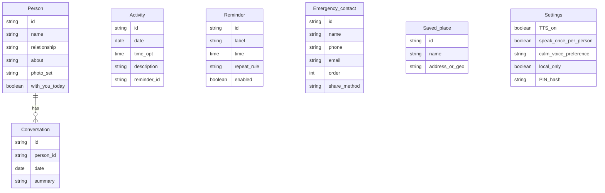

# Functional Requirements Document (FRD)
# Remember Me — Alzheimer's Patient Companion

**Version:** 1.0 (Archived — see module-specific FRDs)  
**Source PRD:** [PRD.md](PRD.md) (Version 0.3)  
**Last Updated:** February 14, 2025  
**Status:** Archived  
**Target audience:** Engineering, QA, and implementation teams.

---

## **Note: This FRD Has Been Split**

This document has been **split into 8 module-specific FRDs** for easier navigation and team-based development. Each module FRD is self-contained and covers one functional area.

**Please refer to the module-specific FRDs in the [FRD/](FRD/) folder:**

- [Module 1: Live Face Recognition & Identification](FRD/FRD-Module1-LiveRecognition.md)
- [Module 2: Conversation Memory](FRD/FRD-Module2-ConversationMemory.md)
- [Module 3: People & Profiles Management](FRD/FRD-Module3-PeopleProfiles.md)
- [Module 4: Daily Activity Log](FRD/FRD-Module4-ActivityLog.md)
- [Module 5: Reminders](FRD/FRD-Module5-Reminders.md)
- [Module 6: Emergency Calling & Location Sharing](FRD/FRD-Module6-Emergency.md)
- [Module 7: Orientation & Calm Mode](FRD/FRD-Module7-OrientationCalm.md)
- [Module 8: Settings & Access Control](FRD/FRD-Module8-Settings.md)

**Index:** See [FRD/README.md](FRD/README.md) for a complete overview and quick navigation.

**The content below is archived for reference only.** Use the module-specific FRDs for implementation and QA.

---

---

## 1. Introduction & Scope

### 1.1 Purpose

This Functional Requirements Document (FRD) translates the business and user requirements described in the Product Requirements Document (PRD) into precise, testable system-level functional requirements. The FRD uses "The system shall…" language to specify behavior, inputs, outputs, validation rules, and edge cases. It is intended for use by software engineers and QA teams to implement and verify the Remember Me web application.

### 1.2 Reference Documents

- **Product Requirements Document (PRD):** [PRD.md](PRD.md), Version 0.3.

### 1.3 In Scope

The following modules and capabilities are in scope for this FRD:

| Module | Description |
|--------|-------------|
| 1 | Live face recognition & identification |
| 2 | Conversation memory |
| 3 | People & profiles management |
| 4 | Daily activity log |
| 5 | Reminders |
| 6 | Emergency calling & location sharing |
| 7 | Orientation (Where am I? / What day? / What time?) and Calm mode |
| 8 | Settings & access control |

### 1.4 Out of Scope

The following are explicitly out of scope for V1, per PRD §8:

- Automatic recording or transcription of real-life conversations.
- Recognizing strangers or public figures (recognition limited to registered persons only).
- Full clinical or medical decision support.
- Multi-patient or facility-wide deployment.
- Integration with wearables or smart home devices.

---

## 2. System Overview

Remember Me is a web application that supports people with Alzheimer's or other memory-related conditions and their caregivers. The system runs in a modern browser (desktop, laptop, or tablet) and provides: (1) live video face recognition with real-time identification of registered persons and optional spoken feedback; (2) per-person conversation memory ("last conversation"); (3) daily activity logging; (4) time-based reminders (e.g., medication); (5) an emergency button that initiates a call and shares the user's location; (6) orientation answers (current time, date, and place) and a calm-mode reassurance flow ("I feel confused"); and (7) configuration of people, places, reminders, and emergency contacts. The primary user is the patient; the caregiver configures data and settings. The system uses the device camera and geolocation when the user grants permission and does not use face or location data for advertising or third-party sharing.

---

## 3. Actors and User Roles

### 3.1 Actor Definitions

| Actor | Description | Primary use |
|-------|-------------|-------------|
| **Patient** | Person with Alzheimer's or memory-related condition; primary end user of the application. | Uses live face recognition, orientation, calm mode, reminders, emergency button, daily activity view, and "See last conversation." |
| **Caregiver** | Family member or professional who sets up and maintains data for the patient. | Adds/edits people and profiles, conversation notes, daily activities, reminders, saved places, emergency contacts, and "who's with you today"; manages settings (TTS, PIN/login). |
| **Admin** | Reserved for future use (e.g., multi-account or facility administration). | Not applicable in V1; permissions may be extended later. |

### 3.2 Permissions Matrix

| Capability | Patient | Caregiver |
|------------|---------|-----------|
| View live face recognition / "Who is this?" | Yes | Yes |
| Upload single photo for identification | Yes | Yes |
| View "Last conversation" for a person | Yes | Yes |
| Add / edit / delete person (name, relationship, photos) | No | Yes |
| Add / edit conversation entries per person | No | Yes |
| View daily activity log | Yes | Yes |
| Add / edit / remove activity log entries | Optional (per config) | Yes |
| View and dismiss/snooze/mark done reminders | Yes | Yes |
| Create / edit / delete reminders | No | Yes |
| Use emergency button (call + share location) | Yes | Yes |
| Configure emergency contacts and share method | No | Yes |
| Use orientation (time / day / where am I) | Yes | Yes |
| Use calm mode ("I feel confused") | Yes | Yes |
| Configure saved places (e.g., Home, Grocery store) | No | Yes |
| Set "who's with you today" per person | No | Yes |
| Change settings (TTS, speak once per person, calm voice, PIN/login, local-only) | No | Yes |

---

## 4. Functional Requirements by Module

### 4.1 Module 1 — Live Face Recognition & Identification

| ID | Requirement | Inputs | Outputs | Behavior / Notes |
|----|-------------|--------|--------|------------------|
| **FR-1.1** | The system shall acquire a live video stream from the device camera when the user starts the "Who is this?" / live view and camera permission is granted. | User action (start live view); browser camera permission. | Live video feed displayed in the application. | If camera permission is denied, see validation rules §5.1. |
| **FR-1.2** | The system shall run face detection and recognition on frames from the video stream at a defined interval and shall display on-screen labels (name, relationship) only for faces that match a registered person above a defined confidence threshold. | Video frames; registered persons (face embeddings and metadata). | Labeled video feed with name and relationship per recognized face. | Labels shall update as faces move or new faces enter the frame. Only registered persons shall be identified. |
| **FR-1.3** | The system shall support an optional single-photo upload as an alternative input for "Who is this?" when the camera is not in use or is denied. | User-selected image file. | Identification result screen (recognized person or "I don't recognize this person"). | Same recognition logic and registered-persons-only rule as live stream. |
| **FR-1.4** | The system shall display "I don't recognize this person" or an equivalent message (or no label) for any face that does not match a registered person above the confidence threshold. | Detected face; registered persons. | No identification or explicit "unrecognized" message. | The system shall not identify or label strangers or public figures. |
| **FR-1.5** | When text-to-speech (TTS) for recognition is enabled in settings, the system shall speak the phrase "This is [Name], [relationship]" when a person is first recognized in the current session, where Name and relationship are taken from the registered person's profile. | Recognized person id; TTS enabled; session state. | Audio output via Web Speech API (or equivalent). | If "speak once per person per session" is enabled, the system shall not speak again for the same person in that session. |
| **FR-1.6** | The system shall allow the user to navigate from a recognized person's label to the "Last conversation" view for that person (Module 2). | User tap/click on label or identified person. | Navigation to conversation memory display. | See FR-2.2. |
| **FR-1.7** | The system shall not use the video stream or face data for advertising or share them with third parties; processing shall be in-browser or under user/caregiver control where technically feasible. | N/A | N/A | Privacy requirement; no behavioral output beyond system behavior. |

---

### 4.2 Module 2 — Conversation Memory

| ID | Requirement | Inputs | Outputs | Behavior / Notes |
|----|-------------|--------|--------|------------------|
| **FR-2.1** | The system shall store at least one "last conversation" per person, consisting of a date and a text summary. | Person id, date, summary (from caregiver or user input). | Stored conversation record. | Optionally, the system may store a short history (e.g., 2–3 previous entries) per person. |
| **FR-2.2** | The system shall display the last conversation (date and summary) when the user selects "See last conversation" from a recognized person in the live view or from a single-photo identification result. | Person id (from recognition flow). | On-screen display: date of last conversation and summary text. | If no conversation exists for that person, see validation rules §5.2. |
| **FR-2.3** | The system shall allow the caregiver to add and edit conversation entries (date and summary) for any registered person. | Person id, date, summary; caregiver authentication if required. | Updated conversation record and confirmation. | Edit includes updating the "last" entry or adding a new one and promoting it to "last." |

---

### 4.3 Module 3 — People & Profiles Management

| ID | Requirement | Inputs | Outputs | Behavior / Notes |
|----|-------------|--------|--------|------------------|
| **FR-3.1** | The system shall allow the caregiver to add a new person with at least: name, relationship, and one or more face photos. An optional "About" note may be provided. | Name, relationship, about (optional), one or more image files. | New person record and updated profile list; face embeddings/photos available for recognition. | Photos are used only for face recognition. Validation: required fields, image format/size; see §5.3. |
| **FR-3.2** | The system shall allow the caregiver to edit an existing person's name, relationship, about note, and photo set (add, replace, or remove photos). | Person id, updated fields and/or images. | Updated person record and profile list; recognition pipeline updated. | Same validation rules as add. |
| **FR-3.3** | The system shall allow the caregiver to delete a person. When a person is deleted, the system shall either remove associated conversation data (cascade) or prevent deletion until conversations are handled, as defined by implementation policy. | Person id; caregiver action. | Person removed from profile list and from recognition set; conversation handling per policy. | See validation rules §5.3 for edge cases. |
| **FR-3.4** | The system shall support an optional "with you today" (or equivalent) flag per person, settable by the caregiver, for use in calm mode ("who's nearby"). | Person id; flag value (on/off). | Updated person record. | Used when live video is not available to determine "who's nearby." |

---

### 4.4 Module 4 — Daily Activity Log

| ID | Requirement | Inputs | Outputs | Behavior / Notes |
|----|-------------|--------|--------|------------------|
| **FR-4.1** | The system shall allow the caregiver (and optionally the patient, per configuration) to add an activity log entry with a description and an optional time. The date shall default to today and may be selectable for past or today. | Date, time (optional), description. | New activity record; updated log view. | Validation: description non-empty; date not in future; see §5.4. |
| **FR-4.2** | The system shall allow the caregiver (and optionally the patient) to edit or remove an existing activity log entry. | Entry id; updated description/time or delete action. | Updated or removed record; updated log view. | Same date/description rules as add. |
| **FR-4.3** | The system shall display a list or timeline of activity entries. The default view shall be "today"; the system shall support viewing past days where implemented. | Selected date (default: today). | List or timeline of entries for that day, with description and optional time. | Sort order: by time if present, else by creation order. |
| **FR-4.4** | The system may create or update an activity log entry when the user marks a reminder as "done," when such a link is configured for that reminder. | Reminder id; "mark as done" action; optional reminder label. | New or updated activity entry (e.g., "Took medicine – 9:00 AM"). | Optional; configurable per reminder. |

---

### 4.5 Module 5 — Reminders

| ID | Requirement | Inputs | Outputs | Behavior / Notes |
|----|-------------|--------|--------|------------------|
| **FR-5.1** | The system shall allow the caregiver to create a reminder with at least: label (e.g., "Morning medicine"), time of day, and repeat rule (e.g., daily or specific days). | Label, time, repeat_rule. | New reminder record. | Validation: time format; repeat rule valid; see §5.5. |
| **FR-5.2** | The system shall allow the caregiver to edit or delete an existing reminder. | Reminder id; updated fields or delete action. | Updated or removed reminder. | — |
| **FR-5.3** | The system shall trigger an in-app alert (e.g., banner or modal) at the scheduled time when the application is open, displaying the reminder label (e.g., "Now it's time to take your medicine"). | Stored reminder schedule; current device time. | On-screen alert with reminder text. | Uses device/local time; time zone changes handled per implementation. |
| **FR-5.4** | The system shall support optional browser push/notification when the reminder is due and the user has granted notification permission, so the user may be reminded when the tab is in the background. | Reminder schedule; notification permission. | Browser notification with reminder label. | If permission is denied, only in-app alert is used; see §5.5. |
| **FR-5.5** | The system shall support optional sound or spoken reminder (TTS) when the reminder is triggered (e.g., "It's time to take your medicine"). | Reminder label; TTS/sound enabled in settings. | Audio output. | Respects system volume and user settings. |
| **FR-5.6** | The system shall allow the user to dismiss the reminder or to snooze it (if snooze is implemented). | User action (dismiss / snooze). | Alert closed; optional snooze timer set. | — |
| **FR-5.7** | The system shall allow the user to mark the reminder as "done." Optionally, the system shall create a corresponding activity log entry when "done" is selected, when so configured. | User action (mark done); optional link to activity log. | Reminder marked done; optional new activity entry. | See FR-4.4. |

---

### 4.6 Module 6 — Emergency Calling & Location Sharing

| ID | Requirement | Inputs | Outputs | Behavior / Notes |
|----|-------------|--------|--------|------------------|
| **FR-6.1** | The system shall display a persistent emergency button (e.g., "Emergency" or "Call for help") that is always easy to find (e.g., on every patient-facing screen or one tap from home). The button shall have a distinct, clear label and color (e.g., red). | N/A | Visible emergency control. | Usability and safety requirement. |
| **FR-6.2** | When the user activates the emergency button, the system shall initiate a phone call to a configured emergency contact by opening the device dialer with the contact's phone number pre-filled (e.g., via `tel:`). The user may be required to confirm "Call" on the device. | Button press; stored emergency contact phone number(s). | Dialer opened with number; call placed after user confirmation. | If no emergency contact is configured, see validation rules §5.6. |
| **FR-6.3** | When the user activates the emergency button, the system shall obtain the user's current location (when permission is granted) and shall make that location available to be shared with the emergency contact (e.g., via pre-filled SMS/email message with coordinates or map link, or via backend if configured). | Button press; Geolocation API (with user permission). | Location acquired; share flow (SMS/email/client) with message containing location. | If location is denied or unavailable, call shall still be offered; share message shall indicate "location unavailable" where applicable; see §5.6. |
| **FR-6.4** | The system shall allow the caregiver to configure one or more emergency contact phone numbers and the preferred method for sharing location (e.g., SMS, email, or in-app/backend). | Contact name, phone, optional email; share method. | Stored emergency contact(s) and share preference. | At least one contact is required for the emergency call flow to be valid. |

---

### 4.7 Module 7 — Orientation & Calm Mode

| ID | Requirement | Inputs | Outputs | Behavior / Notes |
|----|-------------|--------|--------|------------------|
| **FR-7.1** | The system shall display the current time (and optionally the current date) when the user requests "What time is it?" or opens the orientation panel. | User action; device/system time. | On-screen display of current time (and optionally date). | Format shall be clear and readable (e.g., 12- or 24-hour per preference). |
| **FR-7.2** | The system shall display the current date and day of week (e.g., "Saturday, February 14, 2025") when the user requests "What day is it?" or opens the orientation panel. | User action; device date. | On-screen display of date and day of week. | — |
| **FR-7.3** | The system shall resolve "Where am I?" using the user's current location (when permission is granted) by matching coordinates to caregiver-defined saved places (e.g., "Home", "Grocery store"). If a saved place matches within its defined radius, the system shall display that place name (e.g., "You're at home"). If no saved place matches, the system shall use a fallback (e.g., reverse-geocoded street name or "Location not set" / "Enable location"). | User action; Geolocation; saved places (name, address or lat/lng, radius). | Display of place name or fallback text. | If location permission is denied, see §5.7. |
| **FR-7.4** | The system shall provide one-tap or one-click access to orientation (time, date, place) from the main screen, and may present a single "Orientation" panel showing all three. | User action. | Orientation panel or individual answers. | — |
| **FR-7.5** | The system shall support optional TTS for orientation answers (time, date, and/or place) when the user requests to hear the answer. | User action; TTS enabled. | Spoken time, date, and/or place. | — |
| **FR-7.6** | The system shall display a prominent "I feel confused" (or "Calm mode" / "I need reassurance") button with calm, non-alarming wording and color (e.g., soft blue or green). | N/A | Visible calm mode control. | — |
| **FR-7.7** | When the user activates calm mode, the system shall speak a short reassurance message using a soft, calm TTS voice and pace. The message shall include: (1) a reassurance phrase (e.g., "You're safe."); (2) the user's current place (from FR-7.3 logic, e.g., "You're at home."); and (3) optionally, who is nearby (e.g., "Maria is nearby.") when the system has that information from live recognition and/or caregiver-set "with you today." | Button press; location; live recognition result or "with you today" flags. | Spoken reassurance; on-screen same text. | If location is denied, the place phrase may be omitted or replaced with a generic phrase; if no one nearby, that phrase may be omitted or replaced with a generic (e.g., "You're not alone."). See §5.7. |
| **FR-7.8** | When the user activates calm mode, the system shall display the same reassurance message as text on screen and shall allow the user to trigger the spoken message again (e.g., "Hear again"). | Button press; generated message. | On-screen text; optional repeat TTS. | Screen shall be simple and calming (e.g., minimal UI, soft background). |

---

### 4.8 Module 8 — Settings & Access Control

| ID | Requirement | Inputs | Outputs | Behavior / Notes |
|----|-------------|--------|--------|------------------|
| **FR-8.1** | The system shall support optional PIN or login authentication so that only authenticated users (caregivers) can access edit functions (people, conversations, activities, reminders, places, emergency contacts, and settings). The patient may use the application in a view-only or limited-interaction mode without entering the PIN/login. | PIN or credentials; user role/session. | Access granted or denied to edit functions. | Implementation may allow patient to use all read and patient-action flows (e.g., live view, emergency, calm mode) without PIN. |
| **FR-8.2** | The system shall allow the caregiver to enable or disable TTS for face recognition ("This is [Name], [relationship]"). | Toggle (on/off). | Stored setting; recognition TTS on or off. | — |
| **FR-8.3** | The system shall allow the caregiver to enable or disable "speak once per person per session" for face recognition TTS. | Toggle (on/off). | Stored setting. | When on, each recognized person is announced at most once per session. |
| **FR-8.4** | The system shall allow the caregiver to set a calm voice preference (e.g., voice type or rate) for calm mode TTS. | Selection from available options. | Stored setting; used when generating calm mode speech. | — |
| **FR-8.5** | The system shall allow the caregiver to create, read, update, and delete saved places. Each saved place shall have a name and either an address or a geographic definition (e.g., lat/lng and radius). | Name; address or (lat, lng, radius). | CRUD on saved places; used by orientation and calm mode. | — |
| **FR-8.6** | The system shall allow the caregiver to create, read, update, and delete emergency contacts (name, phone, optional email) and to set the order/priority and share method for location. | Contact details; order; share method. | CRUD on emergency contacts; used by emergency flow. | — |
| **FR-8.7** | The system may support an optional "local-only" storage setting such that data is retained only on the device and not sent to a backend. | Toggle (on/off). | Stored setting; affects where data is persisted. | When implemented, recognition and other features may run entirely client-side. |

---

## 5. Validation Rules and Edge Cases

### 5.1 Live Face Recognition (Module 1)

| Case | Condition | Expected system behavior |
|------|------------|--------------------------|
| Camera permission denied | User denies or revokes camera access. | The system shall display a clear message that camera access is required for live view and shall offer the option to use single-photo upload instead (FR-1.3). |
| No face in frame | Video frame contains no detectable face. | The system shall display the video without labels; no TTS shall be triggered. |
| Face not recognized | Detected face does not match any registered person above threshold. | The system shall show "I don't recognize this person" or equivalent, or no label (FR-1.4). Optionally offer "Add this person?" linking to profile management. |
| Multiple faces in frame | Two or more faces in frame. | The system shall attempt to label each detected face independently; each recognized person shall receive a label; unrecognized faces shall be handled per above. |
| Low confidence | Match confidence below threshold. | Treat as unrecognized; do not display a name/relationship for that face. |
| Photo upload invalid or corrupt | User uploads an unreadable or unsupported image. | The system shall display an error message and allow the user to choose another image or cancel. |

### 5.2 Conversation Memory (Module 2)

| Case | Condition | Expected system behavior |
|------|------------|--------------------------|
| No conversation stored | User selects "See last conversation" for a person who has no conversation entry. | The system shall display a message such as "No conversation yet" or equivalent and shall not show a date/summary. |
| Person deleted | User or caregiver attempts to view conversation for a person who has been deleted. | The system shall not expose conversation data for deleted persons; navigation to conversation shall be unavailable or shall show an appropriate message. |

### 5.3 People & Profiles (Module 3)

| Case | Condition | Expected system behavior |
|------|------------|--------------------------|
| Required field missing | Caregiver submits add/edit without name or relationship or without at least one photo (for add). | The system shall reject the submission and display which fields are required. |
| Invalid image | Uploaded file is not a supported image format or exceeds size limits. | The system shall reject the file and display an error; allow retry. |
| Duplicate name | Caregiver adds a person with a name that already exists (if uniqueness is enforced). | Per product policy: either allow duplicate names with a warning or reject and prompt for disambiguation. |
| Delete person with conversations | Caregiver deletes a person who has conversation entries. | The system shall either cascade-delete conversations or block deletion until conversations are removed/reassigned; behavior shall be defined and consistent. |

### 5.4 Daily Activity Log (Module 4)

| Case | Condition | Expected system behavior |
|------|------------|--------------------------|
| Empty description | User/caregiver submits an activity with no description text. | The system shall reject the entry and prompt for a description. |
| Future date | User/caregiver selects a date in the future for an activity. | The system shall reject or warn; policy may allow future date for planned activities. |
| Past-day view | User requests a date that has no entries. | The system shall display an empty list or "No activities" for that day. |

### 5.5 Reminders (Module 5)

| Case | Condition | Expected system behavior |
|------|------------|--------------------------|
| Browser notification permission denied | User denies or revokes notification permission. | The system shall rely on in-app alerts only when the app is open; shall not fail reminder scheduling. |
| Tab in background at reminder time | Reminder is due while the app tab is not focused. | The system shall trigger a browser notification if permission is granted; otherwise the reminder may be shown when the user next opens the app (e.g., "You had a reminder: …"). |
| Reminder time in past on create | Caregiver sets a one-time reminder with a time that has already passed. | The system shall reject or warn and require a future time for one-time reminders. |
| Device time zone change | User's device time zone changes. | Reminders shall be evaluated against current device time; next trigger time may be recalculated. |
| Missed reminder | User does not interact with the app when the reminder fires. | When the user next opens the app, the system may show that a reminder was missed (e.g., list of overdue reminders) or skip, per product policy. |

### 5.6 Emergency (Module 6)

| Case | Condition | Expected system behavior |
|------|------------|--------------------------|
| No emergency contact configured | User presses emergency button but no contact is set. | The system shall display a message that no emergency contact is configured and shall not open the dialer; shall direct the user/caregiver to settings. |
| Location permission denied | User has denied or revoked location permission. | The system shall still open the dialer with the emergency contact number. The share flow shall indicate "location unavailable" in the message or shall still open share with a note that location could not be added. |
| Location unavailable or timeout | Geolocation API fails or times out. | The system shall proceed with call flow; share message shall state that location is unavailable or include last-known location if available. |
| Share method not configured | No SMS/email or backend share method is set. | The system may open a generic share dialog with pre-filled text (including location if available) so the user can choose an app. |

### 5.7 Orientation & Calm Mode (Module 7)

| Case | Condition | Expected system behavior |
|------|------------|--------------------------|
| Location permission denied | User has denied location; "Where am I?" or calm mode requested. | For orientation: the system shall display time and date only; place shall show "Enable location to see place" or "Location not available." For calm mode: the system shall speak reassurance and omit or generalize place (e.g., "You're safe. You're not alone."); "who's nearby" may still come from "with you today." |
| No saved places | No saved places are defined; location is available. | The system shall use reverse geocoding to show a friendly place (e.g., street name) or "Location not set" / "Add places in settings." |
| No one nearby | Calm mode requested; no one in live view and no "with you today" set. | The system shall omit the "who's nearby" phrase or use a generic phrase (e.g., "You're not alone."). |
| TTS unavailable | Browser or device does not support TTS or TTS fails. | The system shall display the full message as text only; shall not block the flow. |

### 5.8 Settings & Access Control (Module 8)

| Case | Condition | Expected system behavior |
|------|------------|--------------------------|
| Invalid PIN | User enters wrong PIN (if PIN lockout is implemented). | After a defined number of failures, the system may temporarily lock further attempts and display a message. |
| Patient view-only | Patient uses the app without entering PIN/login. | The system shall allow all patient-facing read and action flows (live view, orientation, calm mode, emergency, view reminders, view activity log, see last conversation); shall not expose edit screens or settings. |

---

## 6. Data Entities and Relationships

### 6.1 Entity Definitions

| Entity | Key attributes | Description |
|--------|----------------|-------------|
| **Person** | id, name, relationship, about (optional), photo_set / face_embeddings, with_you_today (optional) | A registered person who can be recognized; may be marked "with you today" for calm mode. |
| **Conversation** | id, person_id, date, summary | Last (and optionally previous) conversation entry per person. |
| **Activity** | id, date, time (optional), description, reminder_id (optional) | A single daily activity log entry; may be linked to a reminder. |
| **Reminder** | id, label, time, repeat_rule, enabled | A scheduled reminder (e.g., medication). |
| **Emergency_contact** | id, name, phone, email (optional), order/priority, share_method | Contact and method for emergency call and location share. |
| **Saved_place** | id, name, address or (lat, lng, radius) | Named place for "Where am I?" and calm mode. |
| **Settings** | TTS_on, speak_once_per_person, calm_voice_preference, local_only (optional), PIN_hash (optional) | User preferences and access control; singleton or per account. |

### 6.2 Relationships

- **Person** 1 — * **Conversation**: One person may have one current "last" conversation and optionally multiple historical entries.
- **Person** has many photos/face embeddings: used only for recognition.
- **Activity** optionally references **Reminder** (reminder_id): when a reminder is marked "done," an activity may be created and linked.
- **Settings** is a singleton (or one per account) and does not have a foreign key to other entities.

---

## 7. User Flows

### 7.1 Live Face Recognition (Module 1)

**Happy path**

1. User opens the application and selects "Who is this?" or starts live view.
2. System requests camera permission; user grants it.
3. System displays live video feed and begins face detection/recognition on frames.
4. One or more faces appear in frame; system matches them to registered persons and displays labels (name, relationship) on the video.
5. When a person is first recognized in the session and TTS is enabled, system speaks "This is [Name], [relationship]."
6. User taps a label; system navigates to "Last conversation" for that person (Module 2).

**Failure / alternative paths**

- **Camera denied:** System displays message that camera is required for live view and offers "Upload a photo instead." User may upload a single photo; system runs recognition and shows result (recognized person or "I don't recognize this person").
- **No faces in frame:** Video continues without labels; no TTS.
- **All faces unrecognized:** Labels show "I don't recognize this person" (or no label); no TTS for identification.

---

### 7.2 See Last Conversation (Module 2)

**Happy path**

1. User has identified a person (from live view or photo upload) and taps "See last conversation."
2. System retrieves the most recent conversation entry for that person.
3. System displays date and summary on screen.
4. User may tap back to return to live view or profile.

**Failure / alternative paths**

- **No conversation stored:** System displays "No conversation yet" (or equivalent).
- **Person no longer exists:** If person was deleted, system does not show conversation; user is returned or shown an error.

---

### 7.3 Add Person (Module 3)

**Happy path**

1. Caregiver authenticates (PIN/login) if required and opens People / Add person.
2. Caregiver enters name, relationship, optional about, and uploads one or more face photos.
3. Caregiver submits the form.
4. System validates required fields and images, creates the person record, and generates face embeddings for recognition.
5. System displays confirmation and returns to profile list; new person is available for recognition.

**Failure / alternative paths**

- **Missing required field:** System displays validation error and does not save.
- **Invalid or oversized image:** System displays error and allows caregiver to choose another file.
- **Duplicate name (if enforced):** System warns or rejects and prompts for a different name.

---

### 7.4 Add Reminder (Module 5)

**Happy path**

1. Caregiver opens Reminders and selects Add reminder.
2. Caregiver enters label (e.g., "Morning medicine"), time, and repeat rule (e.g., daily).
3. Caregiver saves.
4. System stores the reminder and will trigger an in-app alert (and optional notification) at the scheduled time.
5. At scheduled time, user sees alert and may dismiss, snooze, or mark done; optionally an activity log entry is created on "done."

**Failure / alternative paths**

- **Notification permission denied:** Reminders still fire in-app when the app is open; no push when tab is in background.
- **Reminder time in past (one-time):** System rejects or warns.
- **Tab closed at reminder time:** If notifications are enabled, user receives browser notification; otherwise reminder may be shown as missed when app is next opened.

---

### 7.5 Emergency Button (Module 6)

**Happy path**

1. User taps "Emergency" / "Call for help."
2. System checks for at least one configured emergency contact; if none, system shows "Configure emergency contact in settings" and stops.
3. System requests location if not already available; user has previously granted permission.
4. System opens the device dialer with the first (or selected) emergency contact number pre-filled; user taps "Call" to connect.
5. System opens the share flow (SMS/email or in-app) with a pre-filled message containing the user's location (e.g., map link); user sends to contact.
6. User completes call and share.

**Failure / alternative paths**

- **No emergency contact:** System does not open dialer; displays message to configure a contact in settings.
- **Location denied:** System still opens dialer. Share flow opens with message text that includes "Location unavailable" or similar.
- **Location timeout:** Same as location denied; call flow continues.

---

### 7.6 Orientation (Module 7)

**Happy path**

1. User taps "What time is it?" / "What day is it?" / "Where am I?" or opens "Orientation."
2. System displays current time, current date and day of week, and (if location permitted) current place from saved places or reverse geocoding.
3. If TTS is requested, system speaks the answers.
4. User may tap back or close.

**Failure / alternative paths**

- **Location denied:** Time and date are shown; place shows "Enable location" or "Location not available."

---

### 7.7 Calm Mode (Module 7)

**Happy path**

1. User taps "I feel confused" / "Calm mode."
2. System obtains current location (if permission granted) and resolves place (saved place or fallback).
3. System determines "who's nearby" from live video recognition and/or "with you today" flags.
4. System composes message: "You're safe. You're at [place]. [Name] is nearby." (or equivalent.)
5. System speaks the message using soft, calm TTS and displays the same text on screen.
6. User may tap "Hear again" to replay the message.

**Failure / alternative paths**

- **Location denied:** System speaks "You're safe." and omits or generalizes place; may add "You're not alone." if no one nearby.
- **No one nearby:** System omits "who's nearby" or says a generic phrase.
- **TTS unavailable:** System displays full message as text only.

---

### 7.8 View Daily Log (Module 4)

**Happy path**

1. User or caregiver opens "Daily log" / "Today."
2. System displays list or timeline of activities for today (default date).
3. User or caregiver may switch to a past day if supported; system displays entries for that day.
4. Caregiver may add, edit, or remove entries (with authentication if required).

**Failure / alternative paths**

- **Empty day:** System displays "No activities" or empty list.
- **Future date (if blocked):** System does not allow selection or shows warning.

---

## 8. Non-Functional Mappings

### 8.1 Mapping of NFRs to Functions

| NFR area | PRD reference | Related FRs | Requirement |
|----------|----------------|-------------|-------------|
| **Usability** | PRD §7 | FR-1.1–1.6, FR-4.3, FR-5.3, FR-6.1, FR-7.4, FR-7.6 | Large click/tap targets, simple navigation; emergency and "I feel confused" always visible; orientation one tap away. |
| **Accessibility** | PRD §7 | FR-1.5, FR-5.5, FR-7.5, FR-7.7, FR-7.8, FR-8.2–8.4 | TTS for recognition, orientation, and calm mode; soft, calm voice for reassurance; high contrast and scalable text (global UI). |
| **Performance** | PRD §7 | FR-1.2, FR-5.3, FR-5.4 | Real-time recognition with low-latency labels; reminders trigger on time. |
| **Privacy & security** | PRD §7 | FR-1.7, FR-6.2–6.4, FR-7.3, FR-7.7, FR-8.1, FR-8.7 | Face data not shared with third parties; camera and location only with consent; optional local-only storage; PIN/login for edit access. |
| **Compliance** | PRD §7 | FR-1.1–1.4, FR-1.7, FR-3.1–3.3 | HIPAA/GDPR considerations for health and biometric data; consent for camera and location; recognition limited to registered persons. |

### 8.2 Traceability Table (NFR id to FR ids)

| NFR-ID | Description | FR ids |
|--------|-------------|--------|
| NFR-1 | Usability: large targets, simple nav, key actions visible | FR-1.1, FR-4.3, FR-5.3, FR-6.1, FR-7.4, FR-7.6 |
| NFR-2 | Accessibility: TTS and calm voice; high contrast, scalable text | FR-1.5, FR-5.5, FR-7.5, FR-7.7, FR-7.8, FR-8.2–8.4 |
| NFR-3 | Performance: real-time recognition; reminders on time | FR-1.2, FR-5.3, FR-5.4 |
| NFR-4 | Privacy & security: no third-party face/location; consent; local-only option | FR-1.7, FR-6.2–6.4, FR-7.3, FR-7.7, FR-8.1, FR-8.7 |
| NFR-5 | Compliance: biometric/location consent; registered-persons-only | FR-1.1–1.4, FR-1.7, FR-3.1–3.3 |

---

## 9. Assumptions and Constraints

### 9.1 Assumptions

- Users have access to a modern web browser (Chrome, Firefox, Safari, or Edge) on a device with a camera and (for location features) geolocation capability.
- The application is served over HTTPS so that camera and geolocation APIs are available.
- The patient or guardian consents to the use of camera and location when prompted; consent is obtained before processing.
- In V1, a single patient/caregiver account is assumed; the caregiver performs setup (people, places, reminders, emergency contacts).
- Device or browser time and time zone are used for reminders and orientation (time/date); the system does not assume a specific server time zone unless implemented.
- Text-to-speech is provided by the browser (e.g., Web Speech API); availability and voice options depend on the device and browser.
- Where a backend exists, data is stored and transmitted in a manner consistent with applicable privacy and security policies (e.g., encryption at rest and in transit).

### 9.2 Constraints

- The system is a web application only; there is no native mobile app in scope for V1.
- The system shall not perform continuous background location tracking unless required for a defined feature (e.g., place-based reassurance); location shall be obtained on demand for emergency, orientation, and calm mode.
- The system shall not provide clinical or medical decision support; it is an aid for orientation, recognition, and safety only.
- The system shall not automatically record or transcribe real-life conversations.
- Face recognition is limited to persons who have been explicitly registered by the caregiver; the system shall not attempt to identify strangers or public figures.
- Emergency calling and location sharing depend on device capabilities (e.g., `tel:` and share APIs); the user may need to confirm "Call" and "Send" on the device.

---

## Document History

| Version | Date | Author | Changes |
|--------|------|--------|---------|
| 1.0 | February 14, 2025 | — | Initial FRD derived from PRD v0.3. |

---

*This FRD is the authoritative source of functional requirements for the Remember Me application. All requirements are testable and stated in "The system shall…" form. For business context and goals, see [PRD.md](PRD.md).*
