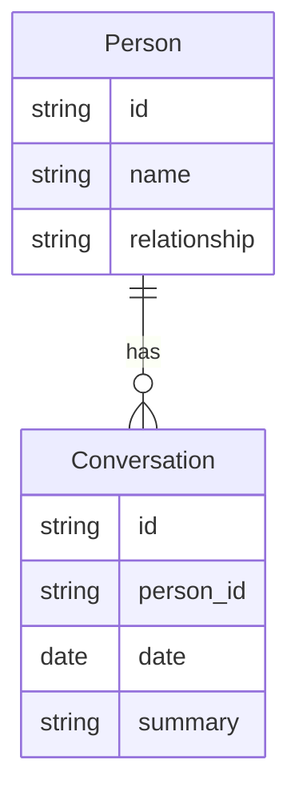

# Functional Requirements Document (FRD)
# Module 2: Conversation Memory

**Version:** 1.0  
**Source PRD:** [../PRD.md](../PRD.md) (Version 0.3)  
**Module:** 2 of 8  
**Last Updated:** February 14, 2025  
**Status:** Formal  
**Target audience:** Engineering, QA, and implementation teams.

---

## 1. Introduction & Scope

### 1.1 Purpose

This FRD covers **Module 2: Conversation Memory** of the Remember Me application. It specifies how the system stores and displays "last conversation" summaries for each registered person, how the caregiver adds and edits these conversation entries, and how the patient accesses this information after recognizing someone. This helps the patient recall what was discussed with that person.

### 1.2 Reference Documents

- **Product Requirements Document (PRD):** [../PRD.md](../PRD.md), Version 0.3, Section 5.2.
- **Related FRDs:** 
  - Module 1: Live Face Recognition (navigation from recognized person to conversation)
  - Module 3: People & Profiles Management (person must exist to have conversations)

### 1.3 In Scope

- Storing at least one "last conversation" (date + summary) per registered person
- Displaying the last conversation when user requests it
- Allowing caregiver to add and edit conversation entries
- Optionally storing a short history (2–3 previous conversations)
- Handling cases where no conversation exists

### 1.4 Out of Scope

- **Automatic recording or transcription** of real-life conversations (manual logging only in V1)
- **Voice notes** or **auto-summary** (future; V1 is text-based entry by caregiver)
- **Person management** (creating persons is in Module 3)

---

## 2. Module Overview

The Conversation Memory module allows caregivers to log brief summaries of conversations the patient has had with registered persons. For each person, the system stores at least the "last conversation" (date and a text summary). When the patient recognizes someone (via Module 1), they can tap to "See last conversation" and be reminded of what they discussed. This reduces repetitive questions and helps maintain continuity in relationships. The caregiver maintains the conversation logs, adding or editing entries as needed.

**Key capabilities:**
- Store and retrieve "last conversation" per person
- Display date and summary
- Caregiver add/edit conversation entries
- Optional conversation history (multiple past entries)

---

## 3. Actors and User Roles (Module 2)

| Actor | Capabilities in Module 2 | Notes |
|-------|-------------------------|--------|
| **Patient** | View "Last conversation" for a recognized person | Read-only access; initiated from Module 1 or person profile |
| **Caregiver** | View, add, and edit conversation entries for any person | Full CRUD (Create, Read, Update) on conversation records; may also delete if policy allows |

**Permissions:**
- **Patient:** Read only (FR-2.2)
- **Caregiver:** Read and write (FR-2.1, FR-2.2, FR-2.3)

---

## 4. Functional Requirements

| ID | Requirement | Inputs | Outputs | Behavior / Notes |
|----|-------------|--------|--------|------------------|
| **FR-2.1** | The system shall store at least one "last conversation" per person, consisting of a date and a text summary. | Person id, date, summary (from caregiver or user input). | Stored conversation record. | Optionally, the system may store a short history (e.g., 2–3 previous entries) per person. |
| **FR-2.2** | The system shall display the last conversation (date and summary) when the user selects "See last conversation" from a recognized person in the live view or from a single-photo identification result. | Person id (from recognition flow or person profile). | On-screen display: date of last conversation and summary text. | If no conversation exists for that person, see validation rules §5. |
| **FR-2.3** | The system shall allow the caregiver to add and edit conversation entries (date and summary) for any registered person. | Person id, date, summary; caregiver authentication if required. | Updated conversation record and confirmation. | Edit includes updating the "last" entry or adding a new one and promoting it to "last." Optionally allows adding multiple historical entries. |

---

## 5. Validation Rules and Edge Cases

| Case | Condition | Expected System Behavior |
|------|------------|--------------------------|
| **No conversation stored** | User selects "See last conversation" for a person who has no conversation entry. | The system shall display a message such as "No conversation yet" or equivalent and shall not show a date/summary. Optionally offer "Add conversation" link for caregiver. |
| **Person deleted** | User or caregiver attempts to view conversation for a person who has been deleted (from Module 3). | The system shall not expose conversation data for deleted persons; navigation to conversation shall be unavailable or shall show an appropriate message (e.g., "Person not found"). |
| **Empty summary** | Caregiver attempts to save a conversation entry with no summary text. | The system shall reject and prompt for a summary; at least one character required. |
| **Invalid date** | Caregiver enters a future date for a conversation. | The system may reject or warn; policy may allow future dates for planned conversations. Default: date should be today or in the past. |
| **Historical conversations** | Multiple conversations stored; user views "last conversation." | The system shall show only the most recent (by date) entry as "last conversation"; older entries may be accessible via a history view if implemented. |

---

## 6. Data Entities (Module 2)

### 6.1 Entities Used

| Entity | Key attributes | Usage in Module 2 |
|--------|----------------|-------------------|
| **Person** | id, name, relationship | Person must exist to have conversation entries; used to link conversations to the correct person. |
| **Conversation** | id, person_id, date, summary | Stores the conversation record; one-to-many relationship with Person (one person can have multiple conversation entries). |

### 6.2 Relationships

- **Person** 1 — * **Conversation**: One person may have zero, one, or multiple conversation entries.
- The "last conversation" is determined by the most recent date in a person's conversation list.
- When a person is deleted (Module 3), conversations may be cascade-deleted or orphaned (per implementation policy; see validation rules).

---

## 7. User Flows

### 7.1 See Last Conversation — Happy Path

1. **User has identified a person** (from Module 1 live view or photo upload) and taps **"See last conversation."**
2. **System retrieves** the most recent conversation entry for that person (by date).
3. **System displays** date and summary on screen (e.g., "Last conversation: February 10, 2025. You talked about the garden, doctor's appointment on Tuesday, and lunch with Sarah.").
4. **User may tap back** to return to live view or person profile.

### 7.2 See Last Conversation — Failure / Alternative Paths

- **No conversation stored:** System displays **"No conversation yet"** (or equivalent) and does not show date/summary. Optionally offers "Add conversation" for caregiver.
- **Person no longer exists:** If person was deleted (Module 3), system does not show conversation; user is returned or shown an error message (e.g., "Person not found").

### 7.3 Add Conversation — Happy Path (Caregiver)

1. **Caregiver authenticates** (if PIN/login required) and opens a person's profile or conversation list.
2. **Caregiver selects "Add conversation"** or equivalent.
3. **Caregiver enters date** (default: today) and **summary text** (e.g., "Discussed upcoming family visit and her new book.").
4. **Caregiver saves** the entry.
5. **System validates** (date and summary non-empty), stores the conversation, and updates the person's "last conversation" if this is the most recent by date.
6. **System displays confirmation** and returns to the conversation list or person profile.

### 7.4 Edit Conversation — Happy Path (Caregiver)

1. **Caregiver opens** a person's conversation list and selects an existing entry.
2. **Caregiver edits** date and/or summary.
3. **Caregiver saves** changes.
4. **System validates** and updates the conversation record; if date changed, "last conversation" may be recalculated.
5. **System displays confirmation.**

---

## 8. Non-Functional Mappings

### 8.1 NFRs Relevant to Module 2

| NFR Area | Requirement | FR IDs |
|----------|-------------|---------|
| **Usability** | Easy access to "last conversation" from recognized person; clear "No conversation yet" messaging | FR-2.2 |
| **Accessibility** | Text displayed clearly; optional TTS if user wants summary read aloud (not required in V1 but could be added) | FR-2.2 |
| **Privacy & Security** | Conversation data is sensitive; stored securely; not shared with third parties | FR-2.1, FR-2.3 |
| **Data Integrity** | Conversation linked to correct person; handling of deleted persons | FR-2.2, FR-2.3 |

### 8.2 Traceability

- **NFR-1 (Usability):** FR-2.2
- **NFR-4 (Privacy & Security):** FR-2.1, FR-2.3

---

## 9. Assumptions and Constraints

### 9.1 Assumptions

- A **Person** must exist (created in Module 3) before conversations can be logged for that person.
- Caregiver has write access and can add/edit conversations; patient has read-only access.
- Conversation summary is text-based (V1); future versions may support voice notes or auto-summarization.
- At least one conversation entry ("last conversation") is sufficient for V1; optional short history (2–3 entries) can be stored if implemented.
- Conversation data is stored in the backend (or local storage for local-only mode); encrypted at rest and in transit per security policy.

### 9.2 Constraints

- **Manual logging only** in V1: caregiver or user must type the conversation summary; no automatic recording or transcription.
- **Text-based:** No voice notes or rich media in V1.
- **Per-person:** Conversations are linked to individual persons; group conversations are not modeled in V1.
- **Date-based "last":** The "last conversation" is the one with the most recent date; if multiple entries have the same date, implementation may use creation timestamp as tiebreaker.

---

## 10. Dependencies

- **Module 1 (Live Face Recognition):** Navigation from FR-1.6 links to Module 2's "See last conversation" (FR-2.2).
- **Module 3 (People & Profiles):** Person must be created before conversations can be logged; deleting a person may cascade-delete conversations or require handling orphaned conversations.

---

## Document History

| Version | Date | Author | Changes |
|--------|------|--------|---------|
| 1.0 | February 14, 2025 | — | Initial Module 2 FRD extracted from full FRD. |

---

*This FRD is for Module 2 only. For other modules, see the FRD/ folder. For business context, see [../PRD.md](../PRD.md).*
