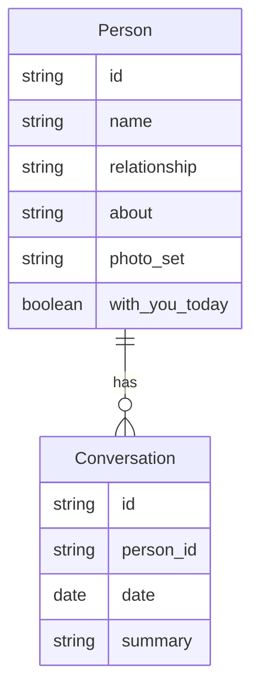

# Functional Requirements Document (FRD)
# Module 3: People & Profiles Management

**Version:** 1.0  
**Source PRD:** [../PRD.md](../PRD.md) (Version 0.3)  
**Module:** 3 of 8  
**Last Updated:** February 14, 2025  
**Status:** Formal  
**Target audience:** Engineering, QA, and implementation teams.

---

## 1. Introduction & Scope

### 1.1 Purpose

This FRD covers **Module 3: People & Profiles Management** of the Remember Me application. It specifies how caregivers add, edit, and delete registered persons, including uploading face photos for recognition, setting relationship and "About" information, and optionally marking someone as "with you today" for use in calm mode. This module is the foundation for face recognition (Module 1) and conversation memory (Module 2).

### 1.2 Reference Documents

- **Product Requirements Document (PRD):** [../PRD.md](../PRD.md), Version 0.3, Section 5.3.
- **Related FRDs:** 
  - Module 1: Live Face Recognition (uses person data for recognition)
  - Module 2: Conversation Memory (conversations linked to persons)
  - Module 7: Orientation & Calm Mode (uses "with you today" flag)

### 1.3 In Scope

- Adding a new person with name, relationship, optional "About" note, and one or more face photos
- Editing existing person details (name, relationship, about, photos)
- Deleting a person (with cascade or blocking policy for associated conversations)
- Setting "with you today" flag per person
- Face photo upload and validation
- Access control (caregiver-only edit access)

### 1.4 Out of Scope

- **Face recognition processing** (see Module 1)
- **Conversation storage** (see Module 2)
- **Multi-patient or role-based access** (V1 is single account; future feature)

---

## 2. Module Overview

This module allows caregivers to build and maintain the set of people the app can recognize. For each person, the caregiver provides a name, relationship (e.g., "daughter," "neighbor"), an optional "About" note (e.g., "Lives in Boston, visits on Sundays"), and one or more face photos. The system uses these photos to generate face embeddings for recognition (Module 1). Caregivers can also edit or delete people and set a "with you today" flag to indicate who is currently with the patient (used for calm mode in Module 7). This module enforces validation rules (e.g., required fields, image format) and handles edge cases like duplicate names and deletion with existing conversations.

**Key capabilities:**
- Add person (name, relationship, about, photos)
- Edit person (update any field or photos)
- Delete person (with conversation handling)
- Set/unset "with you today" flag
- Photo validation (format, size)

---

## 3. Actors and User Roles (Module 3)

| Actor | Capabilities in Module 3 | Notes |
|-------|-------------------------|--------|
| **Caregiver** | Add, edit, delete persons; upload and manage face photos; set "with you today" | Full CRUD access; requires authentication (PIN/login) if enabled |
| **Patient** | View people (read-only in profile list or search) | No edit access; patient can see who is registered but cannot add/edit/delete |

**Permissions:**
- **Caregiver:** Full CRUD (FR-3.1, FR-3.2, FR-3.3, FR-3.4)
- **Patient:** Read-only view (if profile list is accessible to patient)

---

## 4. Functional Requirements

| ID | Requirement | Inputs | Outputs | Behavior / Notes |
|----|-------------|--------|--------|------------------|
| **FR-3.1** | The system shall allow the caregiver to add a new person with at least: name, relationship, and one or more face photos. An optional "About" note may be provided. | Name, relationship, about (optional), one or more image files. | New person record and updated profile list; face embeddings/photos available for recognition. | Photos are used only for face recognition. Validation: required fields (name, relationship, at least one photo), image format/size; see §5. |
| **FR-3.2** | The system shall allow the caregiver to edit an existing person's name, relationship, about note, and photo set (add, replace, or remove photos). | Person id, updated fields and/or images. | Updated person record and profile list; recognition pipeline updated (e.g., regenerate embeddings if photos changed). | Same validation rules as add. At least one photo must remain after edits. |
| **FR-3.3** | The system shall allow the caregiver to delete a person. When a person is deleted, the system shall either remove associated conversation data (cascade) or prevent deletion until conversations are handled, as defined by implementation policy. | Person id; caregiver action (delete confirmation). | Person removed from profile list and from recognition set; conversation handling per policy. | See validation rules §5 for edge cases (e.g., conversations exist). |
| **FR-3.4** | The system shall support an optional "with you today" (or equivalent) flag per person, settable by the caregiver, for use in calm mode ("who's nearby"). | Person id; flag value (on/off). | Updated person record (flag stored). | Used in Module 7 (Calm Mode) when live video is not available to determine "who's nearby." Flag is advisory; caregiver manages it manually. |

---

## 5. Validation Rules and Edge Cases

| Case | Condition | Expected System Behavior |
|------|------------|--------------------------|
| **Required field missing** | Caregiver submits add/edit without name or relationship, or without at least one photo (for add). | The system shall reject the submission and display which fields are required (e.g., "Name, relationship, and at least one photo are required"). |
| **Invalid image** | Uploaded file is not a supported image format (e.g., not JPEG, PNG, etc.) or exceeds size limits (e.g., > 10 MB per image). | The system shall reject the file and display an error (e.g., "Invalid image format" or "Image too large"); allow retry or skip that file. |
| **Duplicate name** | Caregiver adds a person with a name that already exists (if uniqueness is enforced by policy). | Per product policy: either **allow duplicate names** with a warning (e.g., "Another person named Maria exists") or **reject** and prompt for disambiguation (e.g., "Maria Smith" vs "Maria Johnson"). V1 default: allow duplicates with warning. |
| **Delete person with conversations** | Caregiver deletes a person who has conversation entries (Module 2). | The system shall either **cascade-delete conversations** (all conversations for that person are removed) or **block deletion** until conversations are removed/reassigned. Policy to be defined; recommended: block with message "This person has conversation history. Remove conversations first or archive instead of delete." |
| **No photos after edit** | Caregiver removes all photos from a person during edit. | The system shall reject (e.g., "At least one photo is required for recognition") and require at least one photo to remain. |
| **Corrupted or unreadable image** | Uploaded image file is corrupted or cannot be processed. | The system shall display an error and allow the user to choose another file or cancel. |
| **Photo limit** | Caregiver uploads more than a defined maximum number of photos per person (e.g., max 10 photos). | The system may enforce a limit and display an error or warning; accept up to the limit and ignore excess. |

---

## 6. Data Entities (Module 3)

### 6.1 Entities Used

| Entity | Key attributes | Usage in Module 3 |
|--------|----------------|-------------------|
| **Person** | id, name, relationship, about (optional), photo_set / face_embeddings, with_you_today (boolean) | Core entity; created, updated, deleted in this module. Photos stored as file references or embeddings. |
| **Conversation** | id, person_id, date, summary | Linked to Person (Module 2); referenced when deleting a person (cascade or block). |

### 6.2 Relationships

- **Person** 1 — * **Conversation**: When a person is deleted, conversations may be cascade-deleted or deletion may be blocked.
- **Person** has many photos (stored as file paths or embeddings); used only for recognition (Module 1).
- **"with you today" flag** is a simple boolean on Person; used in Module 7 (Calm Mode).

---

## 7. User Flows

### 7.1 Add Person — Happy Path (Caregiver)

1. **Caregiver authenticates** (PIN/login) if required and opens **People / Add person**.
2. **Caregiver enters name** (e.g., "Maria"), **relationship** (e.g., "Your daughter"), **optional about** (e.g., "Lives in Boston"), and **uploads one or more face photos**.
3. **Caregiver submits** the form.
4. **System validates** required fields (name, relationship, at least one photo) and image format/size.
5. **System creates** the person record, generates face embeddings for recognition (Module 1), and stores photos/embeddings.
6. **System displays confirmation** (e.g., "Maria added") and returns to profile list; new person is now available for recognition.

### 7.2 Add Person — Failure / Alternative Paths

- **Missing required field:** System displays validation error (e.g., "Name is required") and does not save; caregiver corrects and resubmits.
- **Invalid or oversized image:** System displays error (e.g., "Image format not supported" or "Image too large"); caregiver chooses another file.
- **Duplicate name (if enforced):** System warns or rejects (e.g., "Another person named Maria exists. Use a different name or add last name."); caregiver chooses unique name or proceeds with duplicate if allowed.

### 7.3 Edit Person — Happy Path (Caregiver)

1. **Caregiver opens** a person's profile and selects **"Edit"**.
2. **Caregiver updates** name, relationship, about, or photos (add new photo, replace, or remove).
3. **Caregiver saves** changes.
4. **System validates** (same rules as add; at least one photo must remain).
5. **System updates** the person record and regenerates face embeddings if photos changed.
6. **System displays confirmation** and returns to profile list or person detail view.

### 7.4 Delete Person — Happy Path (Caregiver)

1. **Caregiver opens** a person's profile and selects **"Delete"**.
2. **System checks** if person has associated conversations (Module 2).
3. **If no conversations** or cascade-delete policy: System displays confirmation dialog (e.g., "Delete Maria? This cannot be undone.").
4. **Caregiver confirms** delete.
5. **System removes** person record and (if cascade) any conversations; person no longer appears in recognition (Module 1).
6. **System displays confirmation** (e.g., "Maria deleted") and returns to profile list.

### 7.5 Delete Person — Failure / Alternative Paths

- **Person has conversations and block policy:** System displays message (e.g., "Maria has conversation history. Remove conversations first or archive instead of delete."); caregiver must go to Module 2 to delete conversations, or choose to archive person instead of hard delete.
- **Cascade delete:** System deletes person and all conversations; caregiver is warned in confirmation dialog.

### 7.6 Set "With You Today" — Happy Path (Caregiver)

1. **Caregiver opens** a person's profile or a dedicated "Who's with you today?" screen.
2. **Caregiver toggles** the "with you today" flag on for one or more persons (e.g., check Maria, uncheck others).
3. **System saves** the flag state per person.
4. **Flag is used** in Module 7 (Calm Mode) when determining "who's nearby."

---

## 8. Non-Functional Mappings

### 8.1 NFRs Relevant to Module 3

| NFR Area | Requirement | FR IDs |
|----------|-------------|---------|
| **Usability** | Simple add/edit forms; clear validation messages; easy photo upload (drag-and-drop or file chooser) | FR-3.1, FR-3.2 |
| **Privacy & Security** | Face photos used only for recognition; not shared with third parties; stored securely | FR-3.1, FR-3.2 |
| **Data Integrity** | Person records correctly linked to conversations; cascade/block policy enforced on delete | FR-3.3 |
| **Compliance** | Biometric data (face photos) consent; stored with encryption; user can delete | FR-3.1, FR-3.3 |

### 8.2 Traceability

- **NFR-1 (Usability):** FR-3.1, FR-3.2
- **NFR-4 (Privacy & Security):** FR-3.1, FR-3.2, FR-3.3
- **NFR-5 (Compliance):** FR-3.1, FR-3.3

---

## 9. Assumptions and Constraints

### 9.1 Assumptions

- Caregiver has edit access (authenticated via PIN/login if enabled in Module 8).
- Patient does not have edit access to people/profiles (read-only if accessible).
- Photos are clear, front-facing, and of sufficient quality for face recognition; system may provide guidance (e.g., "Use a clear, well-lit photo").
- Face embeddings are generated in-browser (e.g., face-api.js) or server-side (e.g., Python library) when photos are uploaded or updated.
- Supported image formats: JPEG, PNG, WebP; max size per image: e.g., 10 MB (configurable).
- At least one photo is required per person for recognition to work.

### 9.2 Constraints

- **Photo-based recognition only:** No video-based enrollment in V1.
- **Manual upload:** Caregiver must upload photos; no automatic photo capture from live video in V1.
- **Single account:** V1 assumes one caregiver manages all people; multi-caregiver or role-based access is future.
- **Cascade or block delete policy:** Must be decided during implementation; recommended: block with option to remove conversations first.
- **Duplicate names:** Policy to allow or disallow must be defined; default: allow duplicates with warning.

---

## 10. Dependencies

- **Module 1 (Live Face Recognition):** Uses person data (embeddings, name, relationship) to recognize faces; if a person is edited or deleted, recognition data must be updated or removed.
- **Module 2 (Conversation Memory):** Conversations are linked to persons; deleting a person affects conversations (cascade or block).
- **Module 7 (Orientation & Calm Mode):** Uses "with you today" flag (FR-3.4) to determine "who's nearby" in calm mode when live video is not available.
- **Module 8 (Settings & Access Control):** Caregiver authentication (PIN/login) controls access to add/edit/delete functions.

---

## Document History

| Version | Date | Author | Changes |
|--------|------|--------|---------|
| 1.0 | February 14, 2025 | — | Initial Module 3 FRD extracted from full FRD. |

---

*This FRD is for Module 3 only. For other modules, see the FRD/ folder. For business context, see [../PRD.md](../PRD.md).*
