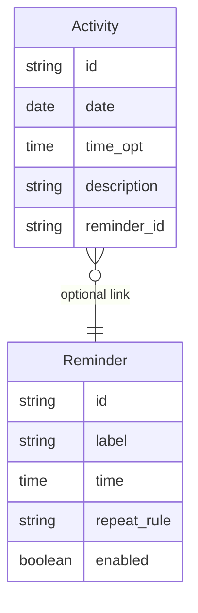

# Functional Requirements Document (FRD)
# Module 4: Daily Activity Log

**Version:** 1.0  
**Source PRD:** [../PRD.md](../PRD.md) (Version 0.3)  
**Module:** 4 of 8  
**Last Updated:** February 14, 2025  
**Status:** Formal  
**Target audience:** Engineering, QA, and implementation teams.

---

## 1. Introduction & Scope

### 1.1 Purpose

This FRD covers **Module 4: Daily Activity Log** of the Remember Me application. It specifies how the system stores and displays daily activities (e.g., "Took medicine," "Had lunch," "Maria visited"), how caregivers and optionally patients can add, edit, or remove entries, and how activities can be linked to reminders when marked "done."

### 1.2 Reference Documents

- **Product Requirements Document (PRD):** [../PRD.md](../PRD.md), Version 0.3, Section 5.4.
- **Related FRDs:** 
  - Module 5: Reminders (optional link from reminder "done" to activity log)

### 1.3 In Scope

- Adding activity log entries (description, optional time, date)
- Editing and removing activity entries
- Displaying activities for "today" (default) and optionally past days
- Optional link from reminder completion to activity log entry
- Validation (non-empty description, no future dates)

### 1.4 Out of Scope

- **Automatic activity tracking** (e.g., from sensors or wearables; V1 is manual entry only)
- **Planned/future activities** (policy may block future dates or allow with warning)
- **Multi-day view or calendar** (V1 focuses on today + past days individually)

---

## 2. Module Overview

The Daily Activity Log helps the patient and caregiver track what has been done each day (e.g., medications taken, meals, exercise, visitors). Caregivers typically maintain the log, adding entries with a description and optional time. The patient can view the log to recall "What did I do today?" or "What did I do yesterday?" Optionally, when the user marks a reminder as "done" (Module 5), the system can automatically create an activity log entry (e.g., "Took medicine – 9:00 AM"). This provides a simple timeline or list view of daily activities.

**Key capabilities:**
- CRUD (Create, Read, Update, Delete) activity entries
- View today's activities (default)
- View past days
- Optional time per entry
- Optional link from reminder "done" to log entry

---

## 3. Actors and User Roles (Module 4)

| Actor | Capabilities in Module 4 | Notes |
|-------|-------------------------|--------|
| **Patient** | View activity log for today and past days; optionally add entries (per config) | Read access always; write access optional (per implementation) |
| **Caregiver** | View, add, edit, remove activity entries for any date | Full CRUD access |

**Permissions:**
- **Patient:** Read always; write optional (FR-4.1, FR-4.2, FR-4.3)
- **Caregiver:** Full CRUD (FR-4.1, FR-4.2, FR-4.3, FR-4.4)

---

## 4. Functional Requirements

| ID | Requirement | Inputs | Outputs | Behavior / Notes |
|----|-------------|--------|--------|------------------|
| **FR-4.1** | The system shall allow the caregiver (and optionally the patient, per configuration) to add an activity log entry with a description and an optional time. The date shall default to today and may be selectable for past or today. | Date, time (optional), description. | New activity record; updated log view. | Validation: description non-empty; date not in future; see §5. |
| **FR-4.2** | The system shall allow the caregiver (and optionally the patient) to edit or remove an existing activity log entry. | Entry id; updated description/time or delete action. | Updated or removed record; updated log view. | Same date/description rules as add. |
| **FR-4.3** | The system shall display a list or timeline of activity entries. The default view shall be "today"; the system shall support viewing past days where implemented. | Selected date (default: today). | List or timeline of entries for that day, with description and optional time. | Sort order: by time if present, else by creation order. |
| **FR-4.4** | The system may create or update an activity log entry when the user marks a reminder as "done," when such a link is configured for that reminder. | Reminder id; "mark as done" action; optional reminder label. | New or updated activity entry (e.g., "Took medicine – 9:00 AM"). | Optional; configurable per reminder (see Module 5 FR-5.7). |

---

## 5. Validation Rules and Edge Cases

| Case | Condition | Expected System Behavior |
|------|------------|--------------------------|
| **Empty description** | User/caregiver submits an activity with no description text. | The system shall reject the entry and prompt for a description (e.g., "Description is required"). |
| **Future date** | User/caregiver selects a date in the future for an activity. | The system shall reject or warn; policy may allow future date for planned activities (e.g., "Lunch at 2 PM tomorrow"). Default V1: reject future dates for activity log. |
| **Past-day view** | User requests a date that has no entries. | The system shall display an empty list or "No activities" for that day. |
| **Invalid time format** | User enters time in unsupported format (if time is free text). | The system shall validate and prompt for correct format (e.g., "HH:MM AM/PM" or 24-hour). If time picker is used, validation is automatic. |
| **Duplicate entry** | Caregiver adds similar entry twice (e.g., "Took medicine" at 9:00 AM and again). | No system block; allow duplicates (user may have taken medicine twice or logged it twice by mistake). Caregiver can edit or remove if error. |
| **Linked reminder entry** | Reminder marked "done" creates activity entry (FR-4.4); user or caregiver edits or deletes that entry. | Activity entry is independent after creation; editing or deleting it does not affect the reminder. Link is one-way (reminder → activity). |

---

## 6. Data Entities (Module 4)

### 6.1 Entities Used

| Entity | Key attributes | Usage in Module 4 |
|--------|----------------|-------------------|
| **Activity** | id, date, time (optional), description, reminder_id (optional) | Core entity; created, updated, deleted in this module. Optional link to Reminder. |
| **Reminder** | id, label, time, repeat_rule, enabled | Referenced when a reminder "done" creates an activity (FR-4.4); not modified by this module. |

### 6.2 Relationships

- **Activity** optionally references **Reminder** (reminder_id): When a reminder is marked "done," an activity may be created and linked.
- Link is one-way: Reminder → Activity; editing or deleting activity does not affect reminder.

---

## 7. User Flows

### 7.1 View Daily Log — Happy Path

1. **User or caregiver** opens **"Daily log"** / **"Today"**.
2. **System displays** list or timeline of activities for today (default date), with description and optional time (e.g., "9:00 AM – Took medicine", "Had lunch", "Maria visited").
3. **User or caregiver** may switch to a past day if supported (e.g., select "Yesterday" or a specific date); system displays entries for that day.
4. **Caregiver** may add, edit, or remove entries (with authentication if required).

**Failure / alternative paths:**
- **Empty day:** System displays "No activities" or empty list.
- **Future date (if blocked):** System does not allow selection or shows warning (e.g., "Cannot view future activities").

### 7.2 Add Activity — Happy Path (Caregiver)

1. **Caregiver** opens daily log and selects **"Add activity"**.
2. **Caregiver** enters **description** (e.g., "Morning walk") and **optional time** (e.g., "8:30 AM"); date defaults to today.
3. **Caregiver saves** the entry.
4. **System validates** (description non-empty, date not in future).
5. **System creates** activity record and updates log view.
6. **System displays** confirmation (e.g., "Activity added").

**Failure / alternative paths:**
- **Empty description:** System rejects and prompts for description.
- **Future date:** System rejects or warns (per policy).

### 7.3 Edit/Remove Activity — Happy Path (Caregiver)

1. **Caregiver** opens daily log and selects an existing entry.
2. **Caregiver** edits description/time or chooses **"Delete"**.
3. **Caregiver** saves changes or confirms delete.
4. **System updates or removes** the activity record.
5. **System displays** updated log view.

### 7.4 Reminder "Done" Creates Activity — Happy Path (Automatic)

1. **User** sees reminder (Module 5) and marks it as **"done"** (e.g., "Morning medicine" reminder at 9:00 AM).
2. **If linked activity is configured** for that reminder, **system automatically creates** an activity entry (e.g., "Took medicine – 9:00 AM") with date = today, time = current time or reminder time, description = reminder label.
3. **Activity appears** in today's log; user or caregiver can view, edit, or remove it independently.

---

## 8. Non-Functional Mappings

### 8.1 NFRs Relevant to Module 4

| NFR Area | Requirement | FR IDs |
|----------|-------------|---------|
| **Usability** | Simple list/timeline view; easy add/edit; clear "today" default | FR-4.1, FR-4.2, FR-4.3 |
| **Accessibility** | Large touch targets for add/edit; clear date labels | FR-4.3 |
| **Data Integrity** | Activity records correctly timestamped; sort order by time | FR-4.3 |

### 8.2 Traceability

- **NFR-1 (Usability):** FR-4.1, FR-4.2, FR-4.3

---

## 9. Assumptions and Constraints

### 9.1 Assumptions

- Caregiver typically maintains the activity log; patient may view and optionally add entries (per configuration in Module 8).
- Activity log is stored per date; entries are independent (no grouping by type or category in V1).
- Optional time is freeform or time-picker; if freeform, system validates format.
- Reminder-to-activity link (FR-4.4) is optional and configured per reminder (Module 5).
- Activities are retained indefinitely or per a retention policy (e.g., archive after 90 days); policy to be defined.

### 9.2 Constraints

- **Manual entry only** in V1: No automatic activity tracking from sensors, location, or wearables.
- **Single-day view** in V1: No multi-day calendar or weekly view (though past days can be viewed individually).
- **Text-based:** Description is plain text; no rich media (photos, voice notes) in V1.
- **Future dates:** Policy to block or allow with warning; default: block.

---

## 10. Dependencies

- **Module 5 (Reminders):** FR-5.7 optionally creates an activity entry when a reminder is marked "done" (FR-4.4).

---

## Document History

| Version | Date | Author | Changes |
|--------|------|--------|---------|
| 1.0 | February 14, 2025 | — | Initial Module 4 FRD extracted from full FRD. |

---

*This FRD is for Module 4 only. For other modules, see the FRD/ folder. For business context, see [../PRD.md](../PRD.md).*
