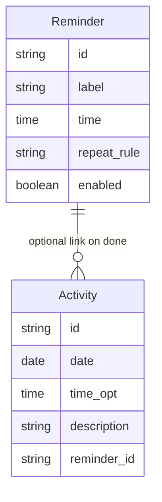

# Functional Requirements Document (FRD)
# Module 5: Reminders

**Version:** 1.0  
**Source PRD:** [../PRD.md](../PRD.md) (Version 0.3)  
**Module:** 5 of 8  
**Last Updated:** February 14, 2025  
**Status:** Formal  
**Target audience:** Engineering, QA, and implementation teams.

---

## 1. Introduction & Scope

### 1.1 Purpose

This FRD covers **Module 5: Reminders** of the Remember Me application. It specifies how the system schedules, triggers, and manages reminders (e.g., medication, appointments), delivers in-app and optional browser notifications, supports optional TTS/sound, and allows the user to dismiss, snooze, or mark reminders as "done." Optionally, marking a reminder "done" can create an activity log entry (Module 4).

### 1.2 Reference Documents

- **Product Requirements Document (PRD):** [../PRD.md](../PRD.md), Version 0.3, Section 5.5.
- **Related FRDs:** 
  - Module 4: Daily Activity Log (optional link from reminder "done" to activity)
  - Module 8: Settings & Access Control (caregiver creates reminders; TTS on/off)

### 1.3 In Scope

- Creating and editing reminders (label, time, repeat rule)
- Triggering in-app alerts at scheduled time
- Optional browser push/notification when tab is in background
- Optional sound or TTS when reminder fires
- Dismissing, snoozing, and marking reminders as "done"
- Optional activity log entry on "done"
- Handling missed reminders, time zone changes, notification permission denied

### 1.4 Out of Scope

- **Smart or adaptive reminders** (e.g., AI-adjusted timing based on behavior; V1 is fixed schedule)
- **Multiple simultaneous snooze** (V1: one snooze at a time or simple snooze logic)
- **Reminder history or analytics** (future feature)

---

## 2. Module Overview

The Reminders module enables caregivers to schedule time-based reminders for the patient (e.g., "Take morning medicine at 9:00 AM daily"). When the scheduled time arrives, the system triggers an in-app alert (e.g., banner or modal) and optionally a browser notification if the app is in the background. The reminder can include optional sound or spoken text (TTS). The patient can dismiss the reminder, snooze it (if implemented), or mark it as "done." When marked "done," the system can optionally create an entry in the Daily Activity Log (Module 4). Caregivers manage the reminder schedule (add, edit, delete), and the system handles time zone changes and missed reminders per policy.

**Key capabilities:**
- CRUD reminders (label, time, repeat rule)
- In-app alert + optional browser notification
- Optional sound/TTS
- Dismiss / snooze / mark done
- Optional activity log entry on "done"
- Handle missed reminders and edge cases

---

## 3. Actors and User Roles (Module 5)

| Actor | Capabilities in Module 5 | Notes |
|-------|-------------------------|--------|
| **Patient** | View reminders when triggered; dismiss, snooze, or mark done | Cannot create/edit reminders; only interacts with triggered alerts |
| **Caregiver** | Create, edit, delete reminders; view reminder schedule; configure repeat rules | Full CRUD access; authenticated (PIN/login) if enabled |

**Permissions:**
- **Patient:** Read (view alert) + dismiss/snooze/done actions (FR-5.3–5.7)
- **Caregiver:** Full CRUD (FR-5.1, FR-5.2)

---

## 4. Functional Requirements

| ID | Requirement | Inputs | Outputs | Behavior / Notes |
|----|-------------|--------|--------|------------------|
| **FR-5.1** | The system shall allow the caregiver to create a reminder with at least: label (e.g., "Morning medicine"), time of day, and repeat rule (e.g., daily or specific days). | Label, time, repeat_rule. | New reminder record. | Validation: time format; repeat rule valid (e.g., "daily", "Mon/Wed/Fri", "one-time"); see §5. |
| **FR-5.2** | The system shall allow the caregiver to edit or delete an existing reminder. | Reminder id; updated fields or delete action. | Updated or removed reminder. | Edit includes changing time, label, repeat rule, or enabled/disabled state. |
| **FR-5.3** | The system shall trigger an in-app alert (e.g., banner or modal) at the scheduled time when the application is open, displaying the reminder label (e.g., "Now it's time to take your medicine"). | Stored reminder schedule; current device time. | On-screen alert with reminder text. | Uses device/local time; time zone changes handled per implementation (see §5). |
| **FR-5.4** | The system shall support optional browser push/notification when the reminder is due and the user has granted notification permission, so the user may be reminded when the tab is in the background. | Reminder schedule; notification permission. | Browser notification with reminder label. | If permission is denied, only in-app alert is used; see §5. |
| **FR-5.5** | The system shall support optional sound or spoken reminder (TTS) when the reminder is triggered (e.g., "It's time to take your medicine"). | Reminder label; TTS/sound enabled in settings. | Audio output. | Respects system volume and user settings. TTS via ElevenLabs (primary) or Web Speech API (fallback). |
| **FR-5.6** | The system shall allow the user to dismiss the reminder or to snooze it (if snooze is implemented). | User action (dismiss / snooze). | Alert closed; optional snooze timer set (e.g., remind again in 10 minutes). | Snooze behavior: one-time reschedule; next trigger at current time + snooze interval. |
| **FR-5.7** | The system shall allow the user to mark the reminder as "done." Optionally, the system shall create a corresponding activity log entry when "done" is selected, when so configured. | User action (mark done); optional link to activity log. | Reminder marked done; optional new activity entry in Module 4. | See Module 4 FR-4.4. If linked, activity entry is created with reminder label as description and current time. |

---

## 5. Validation Rules and Edge Cases

| Case | Condition | Expected System Behavior |
|------|------------|--------------------------|
| **Browser notification permission denied** | User denies or revokes notification permission. | The system shall rely on in-app alerts only when the app is open; shall not fail reminder scheduling. Caregiver may be notified that browser notifications are unavailable. |
| **Tab in background at reminder time** | Reminder is due while the app tab is not focused or closed. | The system shall trigger a browser notification if permission is granted; otherwise the reminder may be shown when the user next opens the app (e.g., "You had a reminder: [label] at [time]" as a "missed" reminder). |
| **Reminder time in past on create** | Caregiver sets a one-time reminder with a time that has already passed today. | The system shall reject or warn and require a future time for one-time reminders. For repeating reminders, next occurrence is calculated (e.g., tomorrow if daily). |
| **Device time zone change** | User's device time zone changes (e.g., travel). | Reminders shall be evaluated against current device time; next trigger time may be recalculated. Policy: reminders are local-time-based (not UTC); system recalculates next occurrence on time zone change detection. |
| **Missed reminder** | User does not interact with the app when the reminder fires (e.g., app closed, tab closed). | When the user next opens the app, the system may show that a reminder was missed (e.g., list of overdue reminders: "You missed: Morning medicine at 9:00 AM") or skip, per product policy. Default V1: show missed reminders when app reopens. |
| **Snooze multiple times** | User snoozes a reminder repeatedly. | System allows multiple snoozes; each snooze reschedules by snooze interval (e.g., +10 min each time). Optional: limit number of snoozes (e.g., max 3). |
| **Mark done for repeating reminder** | User marks a daily reminder as "done." | "Done" applies to this occurrence only; next occurrence is scheduled per repeat rule (e.g., tomorrow at same time for daily). Optional: track "done" status per occurrence if history is implemented. |
| **TTS unavailable** | Browser does not support TTS or TTS fails. | System still displays in-app alert; TTS is optional. No blocking of reminder flow. |
| **Duplicate reminders at same time** | Caregiver creates two reminders for the same time (e.g., "Morning medicine" and "Breakfast" both at 9:00 AM). | System allows; both alerts trigger at 9:00 AM. User can dismiss each independently. |

---

## 6. Data Entities (Module 5)

### 6.1 Entities Used

| Entity | Key attributes | Usage in Module 5 |
|--------|----------------|-------------------|
| **Reminder** | id, label, time, repeat_rule, enabled | Core entity; created, updated, deleted in this module. |
| **Activity** | id, date, time, description, reminder_id | Created in Module 4 when reminder is marked "done" (FR-5.7 + FR-4.4). |

### 6.2 Relationships

- **Reminder** optionally links to **Activity** when "done" creates a log entry (one-way link: Reminder → Activity).
- Multiple reminders can exist independently; no grouping or hierarchy in V1.

---

## 7. User Flows

### 7.1 Add Reminder — Happy Path (Caregiver)

1. **Caregiver** opens **Reminders** and selects **"Add reminder"**.
2. **Caregiver** enters **label** (e.g., "Morning medicine"), **time** (e.g., "9:00 AM"), and **repeat rule** (e.g., "daily").
3. **Caregiver saves** the reminder.
4. **System validates** (time format, repeat rule) and stores the reminder.
5. **System** will trigger an in-app alert (and optional notification) at the scheduled time.

**At scheduled time:**
6. **User** sees alert (e.g., modal: "Now it's time to take your medicine") and may dismiss, snooze, or mark done.
7. **Optionally**, an activity log entry is created on "done" (FR-5.7).

**Failure / alternative paths:**
- **Notification permission denied:** Reminders still fire in-app when the app is open; no push when tab is in background.
- **Reminder time in past (one-time):** System rejects or warns; caregiver adjusts time.
- **Tab closed at reminder time:** If notifications enabled, user receives browser notification; otherwise reminder may be shown as missed when app next opened.

### 7.2 Dismiss, Snooze, or Mark Done — Happy Path (Patient)

1. **Reminder triggers** at scheduled time (in-app alert).
2. **User** sees alert with options: **Dismiss**, **Snooze**, **Mark done**.
3. **User chooses:**
   - **Dismiss:** Alert closes; reminder is done for this occurrence (if repeating, next occurrence remains scheduled).
   - **Snooze:** Alert closes; system reschedules alert in X minutes (e.g., 10 min). User will see alert again.
   - **Mark done:** Alert closes; optional activity log entry created (if configured for this reminder). For repeating reminders, next occurrence remains scheduled.
4. **System** updates reminder state and (if marked done) creates activity entry.

---

## 8. Non-Functional Mappings

### 8.1 NFRs Relevant to Module 5

| NFR Area | Requirement | FR IDs |
|----------|-------------|---------|
| **Usability** | Clear alert with large action buttons (Dismiss/Snooze/Done); simple reminder creation form | FR-5.3, FR-5.6, FR-5.7 |
| **Accessibility** | Optional TTS for reminder ("It's time to take your medicine"); high contrast alert | FR-5.5 |
| **Performance** | Reminders trigger on time (within a few seconds of scheduled time); no missed alerts when app is open | FR-5.3, FR-5.4 |
| **Reliability** | Browser notification fallback when app is in background; missed reminder shown on reopen | FR-5.4 |

### 8.2 Traceability

- **NFR-1 (Usability):** FR-5.3, FR-5.6, FR-5.7
- **NFR-2 (Accessibility):** FR-5.5
- **NFR-3 (Performance):** FR-5.3, FR-5.4

---

## 9. Assumptions and Constraints

### 9.1 Assumptions

- Caregiver creates and manages reminders; patient cannot edit reminder schedule.
- Reminder time is device local time (not UTC); system uses device clock.
- Browser Notifications API is available for push notifications; requires user permission.
- TTS is ElevenLabs (primary) or Web Speech API (fallback); sound is simple audio alert (e.g., chime or beep).
- Snooze interval is configurable (e.g., 10 minutes by default) or fixed per implementation.
- Missed reminders are shown when app reopens (default policy); alternative: skip missed reminders.

### 9.2 Constraints

- **In-app alerts only when app is open:** If app is closed and browser notifications are not granted, user will not see reminder until app is reopened.
- **Device time dependency:** Reminders rely on device/browser time; if device clock is wrong, reminders may fire at wrong time.
- **No smart scheduling:** V1 is fixed time; no AI or adaptive timing.
- **Snooze logic simple:** One snooze at a time (or configurable max snoozes); no complex snooze patterns.

---

## 10. Dependencies

- **Module 4 (Daily Activity Log):** FR-5.7 optionally creates an activity entry when reminder is marked "done" (links to FR-4.4).
- **Module 8 (Settings & Access Control):** TTS enable/disable and sound settings control FR-5.5 behavior.

---

## Document History

| Version | Date | Author | Changes |
|--------|------|--------|---------|
| 1.0 | February 14, 2025 | — | Initial Module 5 FRD extracted from full FRD. |

---

*This FRD is for Module 5 only. For other modules, see the FRD/ folder. For business context, see [../PRD.md](../PRD.md).*
