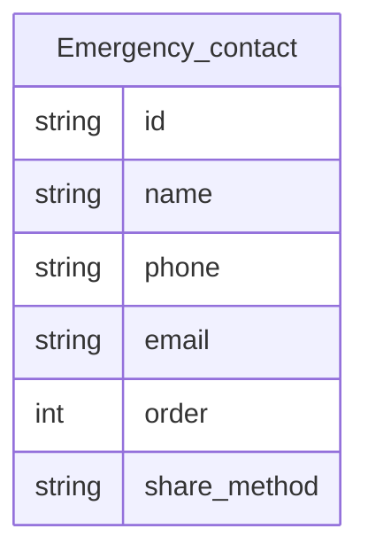

# Functional Requirements Document (FRD)
# Module 6: Emergency Calling & Location Sharing

**Version:** 1.0  
**Source PRD:** [../PRD.md](../PRD.md) (Version 0.3)  
**Module:** 6 of 8  
**Last Updated:** February 14, 2025  
**Status:** Formal  
**Target audience:** Engineering, QA, and implementation teams.

---

## 1. Introduction & Scope

### 1.1 Purpose

This FRD covers **Module 6: Emergency Calling & Location Sharing** of the Remember Me application. It specifies the requirements for a persistent emergency button that initiates a phone call to a configured emergency contact and shares the user's current location via SMS, email, or in-app, enabling quick response in a crisis.

### 1.2 Reference Documents

- **Product Requirements Document (PRD):** [../PRD.md](../PRD.md), Version 0.3, Section 5.6.
- **Related FRDs:** 
  - Module 8: Settings & Access Control (caregiver configures emergency contacts and share method)

### 1.3 In Scope

- Persistent emergency button (always visible or one tap from home)
- Initiating phone call via `tel:` link
- Obtaining user location via browser Geolocation API
- Sharing location (SMS/email or in-app/backend)
- Configuring one or more emergency contacts and share method
- Handling cases: no contact, location denied, location unavailable

### 1.4 Out of Scope

- **Automatic emergency detection** (e.g., fall detection, heart rate; V1 is manual button only)
- **Direct 911/emergency services integration** (V1 uses caregiver-configured contact; user may configure "911" if desired)
- **Two-way communication** or **live tracking** (V1 is one-time call + location share)

---

## 2. Module Overview

The Emergency module provides a safety net for the patient by offering a highly visible emergency button (e.g., red "Emergency" or "Call for help" button). When pressed, the system initiates a phone call to a pre-configured emergency contact (e.g., family member, caregiver) by opening the device dialer with the contact's number. Simultaneously, the system obtains the user's current location (if permission granted) and prepares a share flow (e.g., SMS or email) with a message containing the location (coordinates or map link). The caregiver configures the emergency contact(s) and the preferred share method. If location is denied or unavailable, the call flow still proceeds, and the share message indicates "location unavailable."

**Key capabilities:**
- Persistent emergency button
- Call emergency contact via `tel:` link
- Obtain location via Geolocation API
- Share location (SMS/email or backend)
- Caregiver configures contacts and share method
- Handle no contact, location denied, location unavailable

---

## 3. Actors and User Roles (Module 6)

| Actor | Capabilities in Module 6 | Notes |
|-------|-------------------------|--------|
| **Patient** | Press emergency button; initiate call and location share | Primary user of emergency feature; no configuration access |
| **Caregiver** | Configure emergency contact(s) and share method; test emergency flow | Full configuration access; authenticated (PIN/login) if enabled |

**Permissions:**
- **Patient:** Use emergency button (FR-6.1, FR-6.2, FR-6.3)
- **Caregiver:** Configure contacts and share method (FR-6.4)

---

## 4. Functional Requirements

| ID | Requirement | Inputs | Outputs | Behavior / Notes |
|----|-------------|--------|--------|------------------|
| **FR-6.1** | The system shall display a persistent emergency button (e.g., "Emergency" or "Call for help") that is always easy to find (e.g., on every patient-facing screen or one tap from home). The button shall have a distinct, clear label and color (e.g., red). | N/A | Visible emergency control. | Usability and safety requirement; button must be prominent. |
| **FR-6.2** | When the user activates the emergency button, the system shall initiate a phone call to a configured emergency contact by opening the device dialer with the contact's phone number pre-filled (e.g., via `tel:` URL). The user may be required to confirm "Call" on the device. | Button press; stored emergency contact phone number(s). | Dialer opened with number; call placed after user confirmation. | If no emergency contact is configured, see validation rules §5. Web limitation: user must confirm "Call" on device. |
| **FR-6.3** | When the user activates the emergency button, the system shall obtain the user's current location (when permission is granted) and shall make that location available to be shared with the emergency contact (e.g., via pre-filled SMS/email message with coordinates or map link, or via backend if configured). | Button press; Geolocation API (with user permission). | Location acquired; share flow (SMS/email/in-app) with message containing location. | If location is denied or unavailable, call shall still be offered; share message shall indicate "location unavailable" where applicable; see §5. |
| **FR-6.4** | The system shall allow the caregiver to configure one or more emergency contact phone numbers and the preferred method for sharing location (e.g., SMS, email, or in-app/backend). | Contact name, phone, optional email; share method. | Stored emergency contact(s) and share preference. | At least one contact is required for the emergency call flow to be valid. Caregiver can set order/priority if multiple contacts. |

---

## 5. Validation Rules and Edge Cases

| Case | Condition | Expected System Behavior |
|------|------------|--------------------------|
| **No emergency contact configured** | User presses emergency button but no contact is set. | The system shall display a message that no emergency contact is configured (e.g., "No emergency contact set. Configure in settings.") and shall not open the dialer; shall direct the user/caregiver to settings (Module 8). |
| **Location permission denied** | User has denied or revoked location permission. | The system shall still open the dialer with the emergency contact number. The share flow shall indicate "location unavailable" in the message (e.g., "I need help. Location unavailable.") or shall still open share with a note that location could not be added. |
| **Location unavailable or timeout** | Geolocation API fails or times out (e.g., no GPS signal indoors). | The system shall proceed with call flow; share message shall state that location is unavailable (e.g., "Location could not be determined") or include last-known location if available and policy allows. |
| **Share method not configured** | No SMS/email or backend share method is set, or user's device cannot handle `sms:` or `mailto:` links. | The system may open a generic share dialog with pre-filled text (including location if available) so the user can choose an app (e.g., messaging app, email app). Alternatively, display location as text that user can manually copy/send. |
| **Multiple emergency contacts** | Caregiver has configured multiple contacts (e.g., Mom, Dad, 911). | System may call the first/primary contact automatically, or present a quick-choice list (e.g., "Call Mom / Call 911"). Share location to the same contact(s). V1 default: call first contact and share to same. |
| **User cancels call** | User presses emergency button, dialer opens, but user cancels the call. | Call is not placed; share flow may still occur (location message prepared) or can be canceled by user. No penalty; user can press emergency button again if needed. |
| **Backend SMS/email send** | If backend is configured to auto-send SMS/email with location. | Backend API sends message with location to emergency contact(s); user is notified of success/failure. This is optional; default V1 is client-side `sms:`/`mailto:` links. |

---

## 6. Data Entities (Module 6)

### 6.1 Entities Used

| Entity | Key attributes | Usage in Module 6 |
|--------|----------------|-------------------|
| **Emergency_contact** | id, name, phone, email (optional), order/priority, share_method | Core entity; created, updated, deleted by caregiver (Module 8). Used to initiate call and share location. |

### 6.2 Relationships

- **Emergency_contact** has no direct relationship to other entities; independent configuration.
- Multiple emergency contacts can exist; order/priority determines which is called first.

---

## 7. User Flows

### 7.1 Emergency Button — Happy Path

1. **User** taps **"Emergency"** / **"Call for help"**.
2. **System checks** for at least one configured emergency contact; if none, system shows "Configure emergency contact in settings" and stops.
3. **System requests location** if not already available; user has previously granted permission.
4. **System obtains location** (latitude, longitude or map link).
5. **System opens device dialer** with the first (or selected) emergency contact number pre-filled (e.g., `tel:+15551234567`); **user taps "Call"** to connect.
6. **System opens share flow** (SMS/email or in-app) with a **pre-filled message** containing the user's location (e.g., "I need help. My location: https://maps.google.com/?q=40.7,-74.0"); **user sends** to contact.
7. **User completes call and share.**

### 7.2 Emergency Button — Failure / Alternative Paths

- **No emergency contact:** System does not open dialer; displays message "No emergency contact configured. Go to settings to add a contact."
- **Location denied:** System still opens dialer. Share flow opens with message text: "I need help. Location unavailable (location access denied)." or similar.
- **Location timeout:** Same as location denied; call flow continues.
- **Multiple contacts:** System may show quick-choice list (e.g., "Call Mom / Call 911"); user selects one; dialer opens with that number. Or system calls first/primary contact automatically.
- **User cancels call:** Dialer opened but user cancels before connecting; no call placed. User can press emergency button again.

---

## 8. Non-Functional Mappings

### 8.1 NFRs Relevant to Module 6

| NFR Area | Requirement | FR IDs |
|----------|-------------|---------|
| **Usability** | Emergency button always visible; distinct color/label; simple one-tap action | FR-6.1 |
| **Safety** | Call flow works even if location unavailable; clear messaging if no contact configured | FR-6.2, FR-6.3 |
| **Privacy & Security** | Location shared only with designated emergency contacts; user consent for location | FR-6.3 |
| **Reliability** | Emergency call and location share work in most common scenarios (cellular, Wi-Fi); graceful degradation if location unavailable | FR-6.2, FR-6.3 |

### 8.2 Traceability

- **NFR-1 (Usability):** FR-6.1
- **NFR-4 (Privacy & Security):** FR-6.3
- **NFR (Reliability/Safety):** FR-6.2, FR-6.3

---

## 9. Assumptions and Constraints

### 9.1 Assumptions

- Device has phone capability (cellular or VoIP) or user is on a device that can open dialer links (e.g., smartphone, tablet with cellular).
- Caregiver has configured at least one emergency contact before patient uses the feature.
- User (or guardian) consents to location sharing for emergency purposes; location permission is granted when emergency button is first used.
- Browser Geolocation API is available and device has location capability (GPS, cellular, Wi-Fi positioning).
- Share method (SMS, email, or backend) is configured and functional on the user's device.

### 9.2 Constraints

- **Web limitation:** `tel:` link opens device dialer but user must confirm "Call" on the device; system cannot place call automatically without user interaction.
- **Location accuracy:** Depends on device GPS, cellular, and Wi-Fi signals; may be inaccurate indoors or in areas with poor signal.
- **Share flow:** Client-side `sms:` or `mailto:` links may not work on all devices or browsers; optional backend SMS/email send as fallback.
- **No automatic emergency detection:** V1 requires user to press the button; no fall detection, heart rate monitoring, or automatic SOS in V1.
- **One-time share:** V1 sends location once when button is pressed; no continuous live tracking.

---

## 10. Dependencies

- **Module 8 (Settings & Access Control):** Caregiver configures emergency contacts and share method (FR-6.4) via settings (Module 8 FR-8.6).

---

## Document History

| Version | Date | Author | Changes |
|--------|------|--------|---------|
| 1.0 | February 14, 2025 | — | Initial Module 6 FRD extracted from full FRD. |

---

*This FRD is for Module 6 only. For other modules, see the FRD/ folder. For business context, see [../PRD.md](../PRD.md).*
