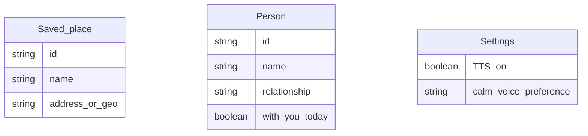

# Functional Requirements Document (FRD)
# Module 7: Orientation & Calm Mode

**Version:** 1.0  
**Source PRD:** [../PRD.md](../PRD.md) (Version 0.3)  
**Module:** 7 of 8  
**Last Updated:** February 14, 2025  
**Status:** Formal  
**Target audience:** Engineering, QA, and implementation teams.

---

## 1. Introduction & Scope

### 1.1 Purpose

This FRD covers **Module 7: Orientation & Calm Mode** of the Remember Me application. It specifies how the system provides grounding information (current time, date, and place) and a calm-mode reassurance flow that uses soft TTS, location-based place names, and "who's nearby" information to help the patient feel at peace when confused or anxious.

### 1.2 Reference Documents

- **Product Requirements Document (PRD):** [../PRD.md](../PRD.md), Version 0.3, Sections 5.7 and 5.8.
- **Related FRDs:** 
  - Module 1: Live Face Recognition (provides "who's nearby" from live video)
  - Module 3: People & Profiles (uses "with you today" flag for "who's nearby")
  - Module 8: Settings & Access Control (caregiver configures saved places, calm voice preference)

### 1.3 In Scope

- Displaying current time, date, and day of week
- Resolving "Where am I?" using saved places and GPS (with reverse-geocoding fallback)
- Optional TTS for orientation answers
- "I feel confused" / Calm mode button
- Soft, reassuring TTS message (safe + place + who's nearby)
- On-screen text of calm message with "hear again" option
- AI-generated reassurance via OpenRouter (model TBD, e.g., Gemini)
- Handling location denied, no saved places, no one nearby

### 1.4 Out of Scope

- **Automatic place detection without user action** (orientation is on-demand; V1 does not continuously track location)
- **Multi-location history or geofencing alerts** (future feature)
- **Two-way conversation or AI chatbot** (V1 is one-way reassurance message only)

---

## 2. Module Overview

The Orientation & Calm Mode module helps the patient feel grounded and at peace. **Orientation** provides simple answers to "What time is it?", "What day is it?", and "Where am I?" The system displays current time and date, and uses GPS plus caregiver-defined saved places (e.g., "Home", "Grocery store") to tell the user where they are in friendly language. **Calm Mode** is activated by a prominent "I feel confused" button. The system responds with a soft, reassuring voice (TTS) and on-screen text, saying "You're safe," identifying the current place, and optionally mentioning who is nearby (from live recognition or "with you today"). The reassurance message can be AI-generated (via OpenRouter, model TBD) for natural, adaptable phrasing, with a template fallback if AI is unavailable. This module helps reduce disorientation and anxiety.

**Key capabilities:**
- Display time, date, day of week
- Resolve "Where am I?" via saved places + GPS (+ reverse geocoding fallback)
- Optional TTS for orientation
- Calm mode button
- Soft TTS reassurance (safe + place + who's nearby)
- AI-generated or template reassurance message
- Handle location denied, no saved places, no one nearby

---

## 3. Actors and User Roles (Module 7)

| Actor | Capabilities in Module 7 | Notes |
|-------|-------------------------|--------|
| **Patient** | Use orientation (time/day/where); use calm mode ("I feel confused") | Primary user; no configuration access |
| **Caregiver** | Configure saved places; set "with you today" flag; configure calm voice preference | Full configuration access (via Module 8); authenticated if enabled |

**Permissions:**
- **Patient:** Read (orientation) + use calm mode (FR-7.1–FR-7.8)
- **Caregiver:** Configure saved places and "with you today" (via Module 8)

---

## 4. Functional Requirements

| ID | Requirement | Inputs | Outputs | Behavior / Notes |
|----|-------------|--------|--------|------------------|
| **FR-7.1** | The system shall display the current time (and optionally the current date) when the user requests "What time is it?" or opens the orientation panel. | User action; device/system time. | On-screen display of current time (and optionally date). | Format shall be clear and readable (e.g., 12- or 24-hour per preference). |
| **FR-7.2** | The system shall display the current date and day of week (e.g., "Saturday, February 14, 2025") when the user requests "What day is it?" or opens the orientation panel. | User action; device date. | On-screen display of date and day of week. | — |
| **FR-7.3** | The system shall resolve "Where am I?" using the user's current location (when permission is granted) by matching coordinates to caregiver-defined saved places (e.g., "Home", "Grocery store"). If a saved place matches within its defined radius, the system shall display that place name (e.g., "You're at home"). If no saved place matches, the system shall use a fallback (e.g., reverse-geocoded street name or "Location not set" / "Enable location"). | User action; Geolocation; saved places (name, address or lat/lng, radius). | Display of place name or fallback text. | If location permission is denied, see validation rules §5. |
| **FR-7.4** | The system shall provide one-tap or one-click access to orientation (time, date, place) from the main screen, and may present a single "Orientation" panel showing all three. | User action. | Orientation panel or individual answers. | — |
| **FR-7.5** | The system shall support optional TTS for orientation answers (time, date, and/or place) when the user requests to hear the answer. | User action; TTS enabled. | Spoken time, date, and/or place via ElevenLabs (primary) or Web Speech API (fallback). | — |
| **FR-7.6** | The system shall display a prominent "I feel confused" (or "Calm mode" / "I need reassurance") button with calm, non-alarming wording and color (e.g., soft blue or green). | N/A | Visible calm mode control. | — |
| **FR-7.7** | When the user activates calm mode, the system shall speak a short reassurance message using a soft, calm TTS voice and pace. The message may be AI-generated (via OpenRouter, model TBD, e.g., Gemini) or use a fixed template. The message shall include: (1) a reassurance phrase (e.g., "You're safe."); (2) the user's current place (from FR-7.3 logic, e.g., "You're at home."); and (3) optionally, who is nearby (e.g., "Maria is nearby.") when the system has that information from live recognition (Module 1) and/or caregiver-set "with you today" (Module 3). | Button press; location; live recognition result or "with you today" flags; OpenRouter API (optional). | Spoken reassurance; on-screen same text. | If location is denied, the place phrase may be omitted or replaced with a generic phrase; if no one nearby, that phrase may be omitted or replaced with a generic (e.g., "You're not alone."). AI generates phrasing with context (safe, place, who's nearby); template fallback if AI unavailable. See §5. |
| **FR-7.8** | When the user activates calm mode, the system shall display the same reassurance message as text on screen and shall allow the user to trigger the spoken message again (e.g., "Hear again"). | Button press; generated message. | On-screen text; optional repeat TTS. | Screen shall be simple and calming (e.g., minimal UI, soft background). |

---

## 5. Validation Rules and Edge Cases

| Case | Condition | Expected System Behavior |
|------|------------|--------------------------|
| **Location permission denied** | User has denied location; "Where am I?" or calm mode requested. | **For orientation:** The system shall display time and date only; place shall show "Enable location to see place" or "Location not available." **For calm mode:** The system shall speak reassurance and omit or generalize place (e.g., "You're safe. You're not alone."); "who's nearby" may still come from "with you today" if set. |
| **No saved places** | No saved places are defined; location is available. | The system shall use reverse geocoding to show a friendly place (e.g., street name: "You're on Main Street") or "Location not set" / "Add places in settings." |
| **No one nearby** | Calm mode requested; no one in live view (Module 1) and no "with you today" set (Module 3). | The system shall omit the "who's nearby" phrase from the calm message, or use a generic phrase (e.g., "You're not alone."). AI prompt shall not include "who's nearby" if data is unavailable. |
| **TTS unavailable** | Browser or device does not support TTS (ElevenLabs or Web Speech API fails). | The system shall display the full message as text only; shall not block the flow. User can read on-screen. |
| **AI (OpenRouter) unavailable** | OpenRouter API fails, times out, or returns error. | The system shall use a fixed template message (e.g., "You're safe. You're at [place]. [Name] is nearby." or "You're safe." if place/nearby unavailable). No blocking; calm mode still works. |
| **AI inappropriate output** | OpenRouter returns off-topic or inappropriate content. | The system shall use a constrained prompt (safe + place + nearby only; short max length) and validate output; if rejected, use template fallback. Optional: content moderation check before TTS. |
| **Multiple people nearby** | Live recognition (Module 1) shows multiple people in frame, or multiple "with you today" flags set. | The system shall mention one or more names (e.g., "Maria and John are nearby.") or just "people are nearby" if too many. AI prompt includes list of names; AI decides phrasing. |
| **User taps "Hear again" repeatedly** | User taps "Hear again" multiple times in calm mode. | The system shall replay the TTS message each time; no limit on replays. |
| **Reverse geocoding fails** | Location available but reverse geocoding API fails or times out. | The system shall display coordinates as fallback (e.g., "You're at 40.7° N, 74.0° W") or "Location unavailable (geocoding error)." |

---

## 6. Data Entities (Module 7)

### 6.1 Entities Used

| Entity | Key attributes | Usage in Module 7 |
|--------|----------------|-------------------|
| **Saved_place** | id, name, address or (lat, lng, radius) | Used to resolve "Where am I?" (FR-7.3) and for calm mode place (FR-7.7). |
| **Person** | id, name, relationship, with_you_today | Used for "who's nearby" in calm mode; live recognition (Module 1) provides real-time, "with you today" flag (Module 3) is fallback. |
| **Settings** | TTS_on, calm_voice_preference | Controls TTS behavior (FR-7.5) and calm voice (soft, slow rate) for FR-7.7. |

### 6.2 Relationships

- **Saved_place** is independent; created and managed in Module 8 (Settings).
- **Person** "with you today" flag is set in Module 3 (People & Profiles).
- Module 7 reads these entities but does not modify them.

---

## 7. User Flows

### 7.1 Orientation — Happy Path

1. **User** taps **"What time is it?" / "What day is it?" / "Where am I?"** or opens **"Orientation"**.
2. **System displays** current time, current date and day of week, and (if location permitted) current place from saved places or reverse geocoding.
3. **If TTS is requested**, system speaks the answers (e.g., "It's 3 o'clock in the afternoon. Today is Saturday, February 14th. You're at home.").
4. **User** may tap back or close.

**Failure / alternative paths:**
- **Location denied:** Time and date are shown; place shows "Enable location" or "Location not available."
- **No saved places:** Reverse geocoding fallback (e.g., "You're on Main Street") or "Location not set."

### 7.2 Calm Mode — Happy Path

1. **User** taps **"I feel confused"** / **"Calm mode"**.
2. **System obtains** current location (if permission granted) and resolves place (saved place or fallback).
3. **System determines "who's nearby"** from live video recognition (Module 1) and/or "with you today" flags (Module 3).
4. **System composes message:**
   - **Option A (AI-generated):** System calls OpenRouter API with context (safe, place, who's nearby); AI returns short, calming message (e.g., "You're safe. You're at home. Maria is with you.").
   - **Option B (Template fallback):** "You're safe. You're at [place]. [Name] is nearby." (or equivalent).
5. **System speaks** the message using **soft, calm TTS** (ElevenLabs or Web Speech API with slow rate) and **displays same text** on screen.
6. **User** may tap **"Hear again"** to replay the message.

**Failure / alternative paths:**
- **Location denied:** System speaks "You're safe." and omits or generalizes place; may add "You're not alone." if no one nearby.
- **No one nearby:** System omits "who's nearby" or says generic phrase (e.g., "You're not alone.").
- **TTS unavailable:** System displays full message as text only.
- **AI unavailable:** System uses template fallback.

---

## 8. Non-Functional Mappings

### 8.1 NFRs Relevant to Module 7

| NFR Area | Requirement | FR IDs |
|----------|-------------|---------|
| **Usability** | Orientation one tap away; calm mode button prominent; clear, simple messaging | FR-7.4, FR-7.6 |
| **Accessibility** | TTS for orientation and calm mode; soft, calm voice; high contrast text | FR-7.5, FR-7.7, FR-7.8 |
| **Privacy & Security** | Location used only for orientation and calm mode (on-demand); not tracked continuously | FR-7.3, FR-7.7 |
| **Performance** | Orientation answers displayed quickly; calm mode message generated and spoken within a few seconds | FR-7.1–FR-7.8 |
| **Reliability** | Graceful fallback (template) if AI unavailable; reverse geocoding fallback if saved places don't match | FR-7.3, FR-7.7 |

### 8.2 Traceability

- **NFR-1 (Usability):** FR-7.4, FR-7.6
- **NFR-2 (Accessibility):** FR-7.5, FR-7.7, FR-7.8
- **NFR-4 (Privacy & Security):** FR-7.3, FR-7.7

---

## 9. Assumptions and Constraints

### 9.1 Assumptions

- User (or guardian) consents to location access for orientation and calm mode; location permission is requested when first used.
- Caregiver has configured at least one saved place (e.g., "Home") for best "Where am I?" experience.
- TTS is ElevenLabs (primary) or Web Speech API (fallback); calm voice uses soft, slow rate.
- AI reassurance (OpenRouter, model TBD e.g., Gemini) is optional; template fallback always available.
- "Who's nearby" comes from live recognition (Module 1) real-time or from "with you today" flags (Module 3) if camera not in use.
- Reverse geocoding is via a free API (e.g., OpenStreetMap Nominatim) or Google Maps Geocoding if configured.

### 9.2 Constraints

- **Location on-demand:** V1 does not continuously track location; location is obtained when user taps orientation or calm mode.
- **AI-generated message:** Dependent on OpenRouter API availability and free-tier model; fallback to template if API fails or quota exceeded.
- **Short message:** AI prompt is constrained to generate short, calming phrases (1–3 sentences) to avoid long or off-topic responses.
- **"Who's nearby" accuracy:** Depends on live recognition quality (Module 1) or caregiver manually setting "with you today"; may be inaccurate if not updated.

---

## 10. Dependencies

- **Module 1 (Live Face Recognition):** Provides real-time "who's nearby" from recognized faces in live video.
- **Module 3 (People & Profiles):** "with you today" flag (FR-3.4) used when live video is not available.
- **Module 8 (Settings & Access Control):** Caregiver configures saved places (FR-8.5) and calm voice preference (FR-8.4); TTS on/off (FR-8.2).

---

## Document History

| Version | Date | Author | Changes |
|--------|------|--------|---------|
| 1.0 | February 14, 2025 | — | Initial Module 7 FRD extracted from full FRD. |

---

*This FRD is for Module 7 only. For other modules, see the FRD/ folder. For business context, see [../PRD.md](../PRD.md).*
