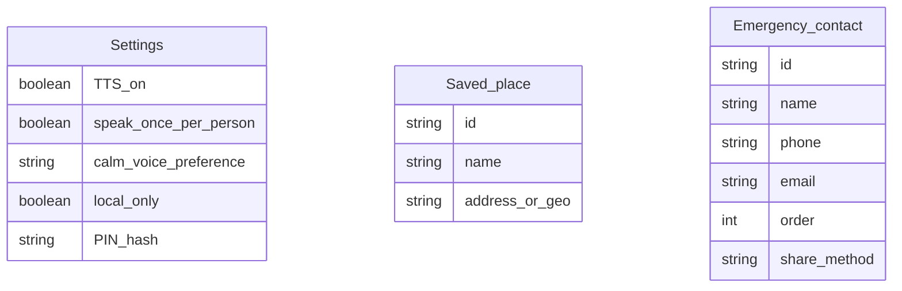

# Functional Requirements Document (FRD)
# Module 8: Settings & Access Control

**Version:** 1.0  
**Source PRD:** [../PRD.md](../PRD.md) (Version 0.3)  
**Module:** 8 of 8  
**Last Updated:** February 14, 2025  
**Status:** Formal  
**Target audience:** Engineering, QA, and implementation teams.

---

## 1. Introduction & Scope

### 1.1 Purpose

This FRD covers **Module 8: Settings & Access Control** of the Remember Me application. It specifies how the system manages user preferences (TTS, calm voice, local-only storage), access control (PIN/login), and configuration of saved places and emergency contacts. This module provides the caregiver with tools to customize the app for the patient's needs and to secure edit functions.

### 1.2 Reference Documents

- **Product Requirements Document (PRD):** [../PRD.md](../PRD.md), Version 0.3 (settings and access control referenced throughout).
- **Related FRDs:** 
  - All other modules depend on settings for TTS, access control, saved places, emergency contacts, etc.

### 1.3 In Scope

- Optional PIN or login authentication for caregiver edit access
- TTS enable/disable for face recognition
- "Speak once per person per session" toggle
- Calm voice preference (e.g., voice type, rate)
- CRUD for saved places (name, address or lat/lng + radius)
- CRUD for emergency contacts (name, phone, email, order, share method)
- Optional "local-only" storage setting
- Patient view-only mode (no authentication required for patient-facing read/action flows)

### 1.4 Out of Scope

- **Multi-user or role-based access** (V1 is single account; caregiver vs patient; no additional roles)
- **Two-factor authentication (2FA)** or **OAuth** (simple PIN or password only in V1)
- **Advanced settings** (e.g., theme customization, language selection; future features)

---

## 2. Module Overview

The Settings & Access Control module enables the caregiver to configure the app's behavior and secure edit functions. The caregiver can enable or disable TTS for face recognition, choose a calm voice preference, and manage saved places (used in Module 7 for "Where am I?" and calm mode) and emergency contacts (used in Module 6). The module also supports optional PIN or login authentication so that only the caregiver (or authorized users) can edit data (people, conversations, reminders, etc.), while the patient can use the app in view-only or limited-interaction mode without authentication. An optional "local-only" storage setting allows data to be kept entirely on the device (no backend sync).

**Key capabilities:**
- PIN/login authentication for edit access
- TTS and calm voice preferences
- CRUD saved places
- CRUD emergency contacts
- Optional local-only storage
- Patient view-only (no auth required for read/action)

---

## 3. Actors and User Roles (Module 8)

| Actor | Capabilities in Module 8 | Notes |
|-------|-------------------------|--------|
| **Caregiver** | Full access to settings; can enable/disable features; manage PIN/login; configure saved places and emergency contacts | Authenticated access; can edit all settings |
| **Patient** | No access to settings; uses app in view-only or limited-interaction mode | Cannot change settings; cannot edit PIN/login |

**Permissions:**
- **Caregiver:** Full CRUD on settings (FR-8.1–FR-8.7)
- **Patient:** No access to settings (read-only for app features)

---

## 4. Functional Requirements

| ID | Requirement | Inputs | Outputs | Behavior / Notes |
|----|-------------|--------|--------|------------------|
| **FR-8.1** | The system shall support optional PIN or login authentication so that only authenticated users (caregivers) can access edit functions (people, conversations, activities, reminders, places, emergency contacts, and settings). The patient may use the application in a view-only or limited-interaction mode without entering the PIN/login. | PIN or credentials; user role/session. | Access granted or denied to edit functions. | Implementation may allow patient to use all read and patient-action flows (e.g., live view, emergency, calm mode) without PIN. Edit screens (add/edit person, reminder, settings) require authentication. |
| **FR-8.2** | The system shall allow the caregiver to enable or disable TTS for face recognition ("This is [Name], [relationship]"). | Toggle (on/off). | Stored setting; recognition TTS on or off (Module 1 FR-1.5). | — |
| **FR-8.3** | The system shall allow the caregiver to enable or disable "speak once per person per session" for face recognition TTS. | Toggle (on/off). | Stored setting (Module 1 FR-1.5). | When on, each recognized person is announced at most once per session. |
| **FR-8.4** | The system shall allow the caregiver to set a calm voice preference (e.g., voice type or rate) for calm mode TTS. | Selection from available options (e.g., voice, rate: slow/normal). | Stored setting; used when generating calm mode speech (Module 7 FR-7.7). | — |
| **FR-8.5** | The system shall allow the caregiver to create, read, update, and delete saved places. Each saved place shall have a name and either an address or a geographic definition (e.g., lat/lng and radius). | Name; address or (lat, lng, radius). | CRUD on saved places; used by orientation and calm mode (Module 7 FR-7.3, FR-7.7). | At least one saved place (e.g., "Home") recommended for best experience. |
| **FR-8.6** | The system shall allow the caregiver to create, read, update, and delete emergency contacts (name, phone, optional email) and to set the order/priority and share method for location. | Contact details; order; share method (SMS, email, backend). | CRUD on emergency contacts; used by emergency flow (Module 6 FR-6.2, FR-6.3, FR-6.4). | At least one emergency contact required for emergency button to work. |
| **FR-8.7** | The system may support an optional "local-only" storage setting such that data is retained only on the device and not sent to a backend. | Toggle (on/off). | Stored setting; affects where data is persisted (local storage vs backend). | When implemented, recognition and other features may run entirely client-side (e.g., face-api.js in browser). |

---

## 5. Validation Rules and Edge Cases

| Case | Condition | Expected System Behavior |
|------|------------|--------------------------|
| **Invalid PIN** | User enters wrong PIN (if PIN lockout is implemented). | After a defined number of failures (e.g., 3), the system may temporarily lock further attempts and display a message (e.g., "Too many attempts. Try again in 5 minutes."). Optional: security question or recovery mechanism. |
| **Patient view-only** | Patient uses the app without entering PIN/login. | The system shall allow all patient-facing read and action flows (live view, orientation, calm mode, emergency, view reminders, view activity log, see last conversation); shall not expose edit screens or settings. Navigation to edit screens redirects to PIN/login prompt. |
| **Saved place: invalid coordinates** | Caregiver enters invalid lat/lng (e.g., out of range: lat > 90 or < -90). | The system shall reject and display an error (e.g., "Invalid coordinates"). If address is entered, system may validate via geocoding or allow any text (policy to be defined). |
| **Saved place: duplicate name** | Caregiver creates two places with the same name (e.g., "Home" and "Home"). | System may allow duplicates with warning or reject; default V1: allow duplicates (e.g., "Home" and "Home Office" are different; "Home" twice is allowed but discouraged). |
| **Emergency contact: invalid phone** | Caregiver enters phone in unsupported format (e.g., no digits). | System validates phone format (e.g., E.164 or local format) and displays error if invalid; allows retry. |
| **Emergency contact: no contacts** | Caregiver deletes all emergency contacts. | Emergency button (Module 6) will show "No emergency contact configured" on press; system warns caregiver before allowing deletion of last contact (e.g., "This is the last emergency contact. Are you sure?"). |
| **Local-only mode enabled** | Caregiver toggles "local-only" on. | All data (people, conversations, activities, reminders, places, contacts) is stored in browser local storage or IndexedDB; no backend sync. Recognition runs client-side (e.g., face-api.js). If backend was previously used, data may be migrated or cleared (policy to be defined). |
| **TTS unavailable** | Browser does not support TTS (ElevenLabs or Web Speech API fails). | Settings still allow toggling TTS on/off; when TTS is used (Modules 1, 5, 7), system falls back to text-only display if TTS unavailable. No blocking of settings access. |

---

## 6. Data Entities (Module 8)

### 6.1 Entities Used

| Entity | Key attributes | Usage in Module 8 |
|--------|----------------|-------------------|
| **Settings** | TTS_on, speak_once_per_person, calm_voice_preference, local_only, PIN_hash | Core entity; created, updated in this module. Singleton or one per account. |
| **Saved_place** | id, name, address or (lat, lng, radius) | CRUD in this module (FR-8.5); used by Module 7. |
| **Emergency_contact** | id, name, phone, email, order, share_method | CRUD in this module (FR-8.6); used by Module 6. |

### 6.2 Relationships

- **Settings** is a singleton (or one per account); no foreign keys to other entities.
- **Saved_place** and **Emergency_contact** are independent entities managed in this module.

---

## 7. User Flows

### 7.1 Caregiver Accesses Settings — Happy Path

1. **Caregiver** opens **Settings**.
2. **If PIN/login is enabled**, system prompts for authentication; caregiver enters PIN/password.
3. **System validates** credentials and grants access.
4. **Caregiver** views and edits settings (TTS, calm voice, saved places, emergency contacts, etc.).
5. **Caregiver** saves changes; system updates settings and confirmation displayed.

**Failure / alternative paths:**
- **Invalid PIN:** System displays error (e.g., "Incorrect PIN"); allows retry (with lockout after X failures).
- **Patient attempts to access settings:** System prompts for PIN; if not entered or incorrect, access denied and user returned to main screen.

### 7.2 Add Saved Place — Happy Path (Caregiver)

1. **Caregiver** opens **Settings → Saved Places** and selects **"Add place"**.
2. **Caregiver** enters **name** (e.g., "Home") and **address or coordinates** (e.g., "123 Main St" or lat/lng + radius).
3. **Caregiver** saves.
4. **System validates** (name and location non-empty; coordinates in valid range).
5. **System creates** saved place record; available for Module 7 (orientation, calm mode).
6. **System displays** confirmation (e.g., "Home added").

**Failure / alternative paths:**
- **Invalid coordinates:** System rejects and prompts for correction.
- **Missing name:** System rejects and prompts for name.

### 7.3 Add Emergency Contact — Happy Path (Caregiver)

1. **Caregiver** opens **Settings → Emergency Contacts** and selects **"Add contact"**.
2. **Caregiver** enters **name** (e.g., "Mom"), **phone** (e.g., "+15551234567"), **optional email**, and **share method** (e.g., SMS).
3. **Caregiver** saves.
4. **System validates** (phone format) and creates emergency contact record; available for Module 6.
5. **System displays** confirmation (e.g., "Mom added as emergency contact").

**Failure / alternative paths:**
- **Invalid phone:** System rejects and prompts for valid phone number.

### 7.4 Patient Uses App Without Authentication — Happy Path

1. **Patient** opens app (no PIN/login prompt for patient view).
2. **Patient** can use live view (Module 1), orientation (Module 7), calm mode (Module 7), emergency button (Module 6), view reminders (Module 5), view activity log (Module 4), see last conversation (Module 2).
3. **If patient taps "Edit" or "Settings"**, system prompts for PIN; patient cannot proceed without authentication.

---

## 8. Non-Functional Mappings

### 8.1 NFRs Relevant to Module 8

| NFR Area | Requirement | FR IDs |
|----------|-------------|---------|
| **Security** | PIN/login protects edit functions; hashed storage of PIN; optional lockout after failures | FR-8.1 |
| **Usability** | Settings organized and easy to find; clear labels; simple forms for saved places and emergency contacts | FR-8.2–FR-8.7 |
| **Privacy** | Optional local-only storage keeps data on device; no backend sync | FR-8.7 |
| **Flexibility** | TTS and calm voice preferences allow customization for patient needs | FR-8.2, FR-8.3, FR-8.4 |

### 8.2 Traceability

- **NFR-4 (Privacy & Security):** FR-8.1, FR-8.7
- **NFR-1 (Usability):** FR-8.2–FR-8.6

---

## 9. Assumptions and Constraints

### 9.1 Assumptions

- Caregiver has sole access to settings in V1; patient cannot edit settings or bypass PIN/login.
- PIN/login is optional; if not enabled, anyone with device access can edit (suitable for single-user home environment).
- Saved places and emergency contacts are configured by caregiver before patient uses those features (Module 6, Module 7).
- TTS preference (on/off, speak once) applies globally to all recognition events (Module 1).
- Calm voice preference applies to calm mode TTS (Module 7).
- Local-only storage is optional; default is backend sync (if backend exists); local-only uses browser storage (localStorage or IndexedDB).

### 9.2 Constraints

- **Simple authentication:** V1 is PIN (numeric or alphanumeric) or password (text); no 2FA, OAuth, or biometric in V1.
- **No recovery mechanism:** If PIN is forgotten, implementation must provide a recovery path (e.g., security question, reset via email, or factory reset that clears all data).
- **Single account:** V1 does not support multiple caregivers with different PINs or roles; one caregiver manages all settings.
- **Saved places and emergency contacts:** No limit on number in V1 (or implementation may enforce a reasonable limit, e.g., 10 places, 5 contacts).

---

## 10. Dependencies

- **All modules:** Settings in Module 8 control behavior across all modules (TTS in Module 1, 5, 7; saved places in Module 7; emergency contacts in Module 6; access control for all edit functions).

---

## Document History

| Version | Date | Author | Changes |
|--------|------|--------|---------|
| 1.0 | February 14, 2025 | — | Initial Module 8 FRD extracted from full FRD. |

---

*This FRD is for Module 8 only. For other modules, see the FRD/ folder. For business context, see [../PRD.md](../PRD.md).*
